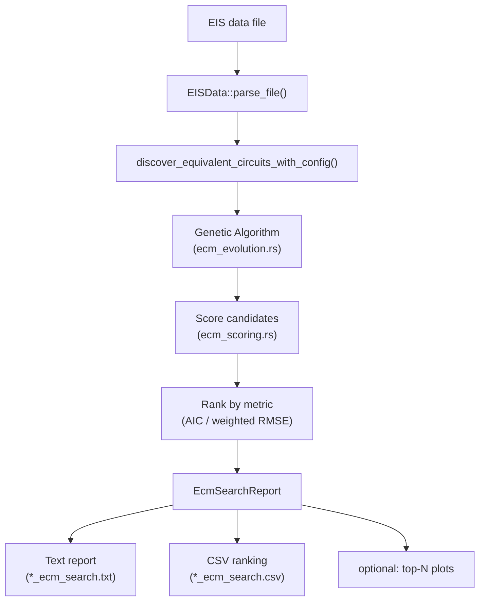
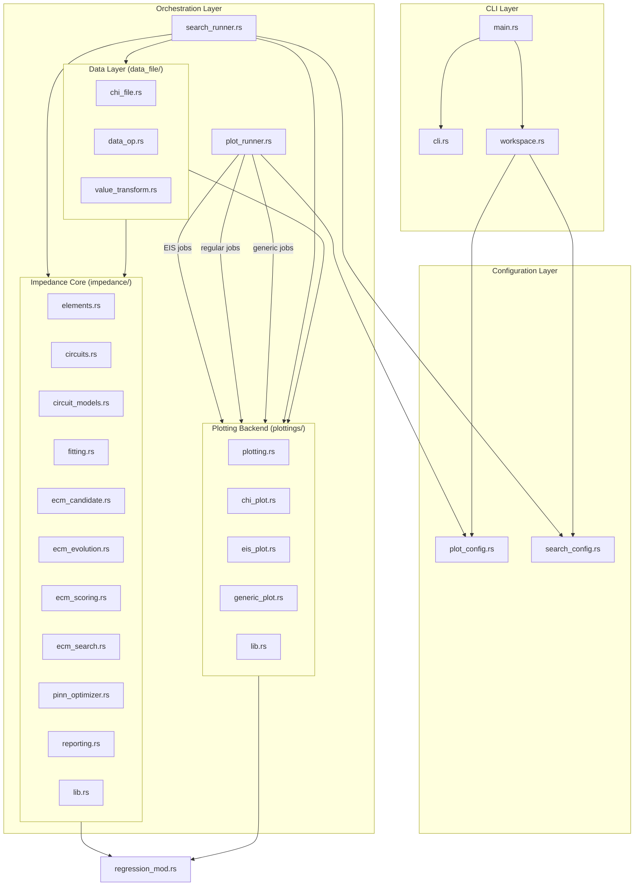
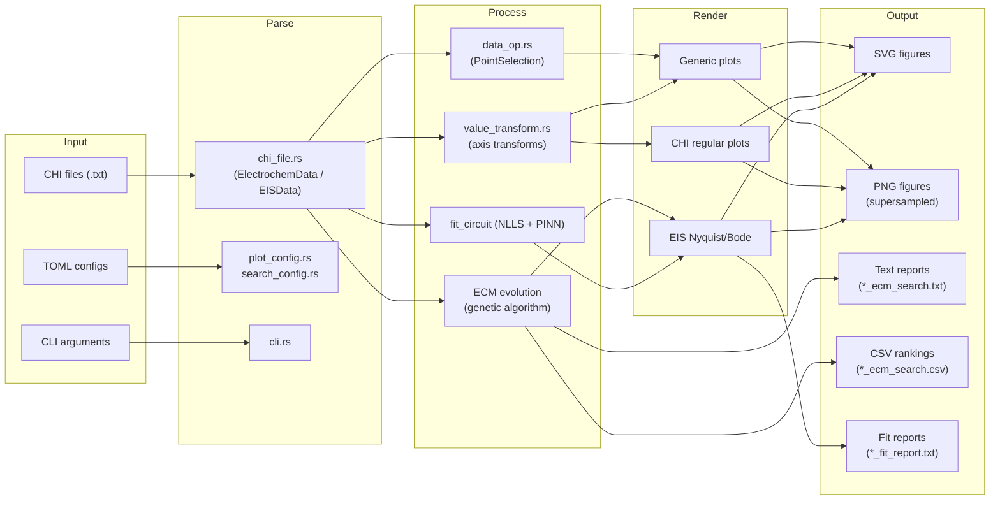
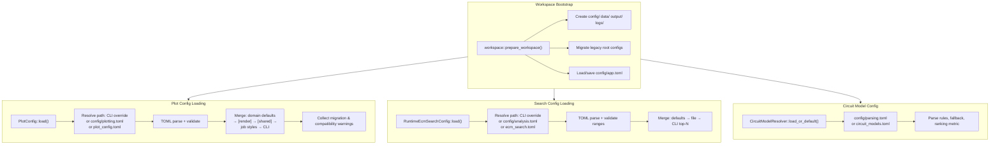

# rust_electroanalysis_cli — Electrochemical Data Analysis CLI

`rust_electroanalysis_cli` is a command-line tool for electrochemical data workflows, including EIS fitting/search and OCPT/sensor time-series analysis pipelines (`transient`, `calibration`, `mechanism`, `signal`, `health`, `estimate`).

---

## Table of Contents

- [1. Overview](#1-overview)
  - [Supported Experiment Types](#supported-experiment-types)
  - [Supported Input Formats](#supported-input-formats)
  - [Runtime Requirements](#runtime-requirements)
  - [Subsystems Overview](#subsystems-overview)
  - [Key Capabilities](#key-capabilities)
- [2. Scientific Data Model](#2-scientific-data-model)
  - [Core Types](#core-types)
  - [Experiment TOML Schema](#experiment-toml-schema)
  - [Data Validation and Diagnostics](#data-validation-and-diagnostics)
  - [PlotData Compatibility](#plotdata-compatibility)
- [3. Installation and Build](#3-installation-and-build)
  - [Prerequisites](#prerequisites)
  - [Build](#build)
  - [Development Workflow](#development-workflow)
  - [Testing](#testing)
  - [Release Build](#release-build)
- [4. Input File Formats and Automatic Detection](#4-input-file-formats-and-automatic-detection)
  - [Minimal Examples](#minimal-examples)
- [5. General CLI Syntax](#5-general-cli-syntax)
- [6. Configuration](#6-configuration)
  - [Workspace Layout](#workspace-layout)
  - [Plotting Configuration (`config/plotting.toml`)](#plotting-configuration-configplottingtoml)
  - [Analysis Configuration (`config/analysis.toml`)](#analysis-configuration-configanalysistoml)
  - [Circuit Model Configuration (`config/parsing.toml`)](#circuit-model-configuration-configparsingtoml)
  - [Application State (`config/app.toml`)](#application-state-configapptoml)
  - [Configuration Precedence](#configuration-precedence)
  - [Configuration Examples](#configuration-examples)
  - [Migrating from Legacy Configuration](#migrating-from-legacy-configuration)
- [7. Getting Started](#7-getting-started)
  - [Step 1: Install the Application](#step-1-install-the-application)
  - [Step 2: Locate or Generate Configuration Files](#step-2-locate-or-generate-configuration-files)
  - [Step 3: Configure Input and Output Directories](#step-3-configure-input-and-output-directories)
  - [Step 4: Validate the Configuration](#step-4-validate-the-configuration)
  - [Step 5: Run the CLI](#step-5-run-the-cli)
  - [Step 6: Verify Outputs](#step-6-verify-outputs)
- [8. Command Compatibility Matrix](#8-command-compatibility-matrix)
- [9. Verified Command Usage](#9-verified-command-usage)
  - [9.1 `plot`](#91-plot)
  - [9.2 `eis`](#92-eis)
  - [9.3 `transient`](#93-transient)
  - [9.4 `calibration`](#94-calibration)
  - [9.5 `mechanism`](#95-mechanism)
  - [9.6 `signal`](#96-signal)
  - [9.7 `health`](#97-health)
  - [9.8 `estimate`](#98-estimate)
- [10. Equivalent-Circuit Model (ECM) Search](#10-equivalent-circuit-model-ecm-search)
  - [Search Pipeline](#search-pipeline)
  - [Evolutionary Algorithm](#evolutionary-algorithm)
  - [Seed Circuits](#seed-circuits)
  - [Scoring and Ranking](#scoring-and-ranking)
  - [Reports](#reports)
- [11. Circuit Model System](#11-circuit-model-system)
  - [Circuit String Syntax](#circuit-string-syntax)
  - [Supported Elements](#supported-elements)
  - [Model Resolution](#model-resolution)
- [12. Plot Types and Features](#12-plot-types-and-features)
  - [EIS Plots (Nyquist / Bode)](#eis-plots-nyquist--bode)
  - [Regular (CHI) Plots](#regular-chi-plots)
  - [Generic Plots](#generic-plots)
  - [Regression Overlays](#regression-overlays)
  - [Axis Transforms](#axis-transforms)
- [13. Output Layout](#13-output-layout)
  - [Legacy Compatibility](#legacy-compatibility)
- [14. Module Documentation](#14-module-documentation)
  - [CLI Layer](#cli-layer)
  - [Configuration Layer](#configuration-layer)
  - [Data Layer (`data_file/`)](#data-layer-data_file)
  - [Impedance Core (`impedance/`)](#impedance-core-impedance)
  - [Plotting Backend (`plottings/`)](#plotting-backend-plottings)
  - [Orchestration Layer](#orchestration-layer)
  - [Regression Module](#regression-module)
- [15. Dependencies](#15-dependencies)
- [16. Usage Guide](#16-usage-guide)
  - [Quick Start](#quick-start)
  - [Plotting Workflows](#plotting-workflows)
  - [ECM Search Workflows](#ecm-search-workflows)
  - [Troubleshooting](#troubleshooting-1)
- [17. Reproducibility and Limitations](#17-reproducibility-and-limitations)
- [18. Current Documented Limitations](#18-current-documented-limitations)
- [19. Developer Documentation](#19-developer-documentation)
  - [Documentation Authority and Conflict Resolution](#documentation-authority-and-conflict-resolution)
  - [Adding a New Circuit Element](#adding-a-new-circuit-element)
  - [Adding a New Plot Type](#adding-a-new-plot-type)
  - [Adding a New Regression Model](#adding-a-new-regression-model)
  - [Adding a New File Format Parser](#adding-a-new-file-format-parser)
  - [Coding Conventions](#coding-conventions)
- [20. Scientific Correctness and Artifact Migration](#20-scientific-correctness-and-artifact-migration)
- [21. Troubleshooting](#21-troubleshooting)
- [22. License](#22-license)

---

## 1. Overview

`rust_electroanalysis_cli` is a command-line tool for electrochemical data workflows, including EIS fitting/search and OCPT/sensor time-series analysis pipelines (`transient`, `calibration`, `mechanism`, `signal`, `health`, `estimate`).

It is designed for electrochemical researchers and analysts who need to:

- **Parse** CHI instrument electrochemical data files (EIS spectra, chronoamperometry, voltammetry, OCPT, etc.)
- **Visualize** data through publication-quality plots rendered at configurable DPI in both SVG and PNG formats
- **Fit** EIS data to equivalent-circuit models using nonlinear least-squares optimization (Levenberg–Marquardt) and PINN-based optimizers
- **Discover** optimal circuit topologies automatically via a genetic algorithm that evolves circuit structures
- **Score and rank** candidate circuits using scalar-residual RSS, Gaussian BIC, an explicitly named legacy score, and weighted RMSE
- **Export** results as plain-text reports, CSV rankings, and high-resolution figures

### Supported Experiment Types

1. CHI EIS CSV (`Freq/Hz`, `Z'/ohm`, `Z"/ohm`)
2. CHI OCPT/time-series CSV (`Time/sec`, `Potential/V`)
3. General time-series sensor CSV or Excel (`.xlsx`) with `time`/`timestamp` + numeric channels
4. Excel workbooks containing compatible OCPT/transient/calibration/general time-series tables (XLSX EIS ingestion is not supported)

### Supported Input Formats

1. `.csv`, `.txt`, `.dat` (text-based, UTF-8 encoded)
2. `.xlsx` (Excel workbook; parsed through the unified data pipeline for time-series tables)
3. `.xls` is explicitly rejected

**Not supported:**
- Binary files such as `.bin`, `.raw` are intentionally unsupported.
  - During batch/directory processing, binary files are **skipped with a warning** and do not cause the workflow to fail.
  - When supplied as an explicit single-file input, binary files produce a **structured error** explaining that binary input is not supported and recommending export to CSV or `.xlsx`.

### Runtime Requirements

1. Rust toolchain (Cargo)
2. macOS/Linux/Windows (validated on macOS in this run)

### Subsystems Overview

The application is organized into four major subsystems:

| Subsystem | Purpose |
|-----------|---------|
| **Data file parser** (`data_file/`) | Reads CHI-format electrochemical files, extracts metadata and measurement columns |
| **Scientific domain** (`domain/`) | Owns aligned multi-channel measurements, experiment metadata, diagnostics, and provenance |
| **Impedance engine** (`impedance/`) | Circuit model AST, element equations, fitting, evolutionary search, scoring, and reporting |
| **Plotting backend** (`plottings/`) | High-quality figure rendering in SVG + supersampled PNG, supporting 9 plot geometries |

These are connected by typed workflow façades (`fitting/` and `runners/`) plus the existing orchestration layer (`plot_runner.rs`, `search_runner.rs`). TOML configuration and scientific algorithms remain in their existing modules.

---

## 2. Scientific Data Model

Phase 1 adds an experiment-oriented foundation without changing numerical fitting or the plotting renderer. Source data enters through `data_file`, is represented by the types in `domain`, and can still be projected into the existing `PlotData` type for current plotting workflows.

### Core Types

`MultiChannelMeasurement` stores a single shared `time` axis and one or more named `MeasurementChannel`s. Each channel has a unit, optional sensor/analyte identifiers, optional metadata, and `Vec<Option<f64>>` values. `None` preserves a missing reading at its original timestamp.

`ElectrochemicalExperiment` adds the context needed for future ion-selective membrane analysis: `SensorMetadata`, optional `ReferenceMetadata`, a sample matrix, environmental series, ordered `ExperimentEvent`s, and `AnalysisProvenance`. The event model currently includes concentration steps, flow/temperature/ionic-strength changes, interferent additions, flush and reading boundaries, and manual annotations.

### Experiment TOML Schema

Experiment metadata is separate from plotting configuration and can be loaded with `load_experiment_metadata` or combined with a measurement using `data_file::load_experiment`:

```toml
experiment_id = "exp-001"
sample_matrix = "aqueous buffer"

[sensor]
sensor_id = "sensor-7"
sensor_type = "ion_selective_membrane"
analyte = "K+"
manufacturer = "Example Instruments"
model = "ISE-1"

[reference]
reference_id = "ref-1"
electrode_type = "Ag/AgCl"
potential_unit = "V"

[[environmental_data]]
name = "temperature"
unit = "C"
time = [0.0, 1.0, 2.0]
values = [25.0, 25.1, 25.1]

[[events]]
timestamp = 1.0
kind = "concentration_step"
value = 0.001
unit = "mol/L"
analyte = "K+"

[[events]]
timestamp = 0.0
kind = "reading_start"
annotation = "baseline"
```

Event records are validated and ordered by timestamp when an `ElectrochemicalExperiment` is constructed. The schema also accepts `environmental_series` as a compatibility alias for `environmental_data`.

### Data Validation and Diagnostics

The measurement constructor rejects an empty time axis, missing channels, non-finite timestamps, and channels whose value vectors do not align with the shared axis. Parsers retain valid rows and return `ParseDiagnostics` alongside the measurement. Diagnostics report total rows, successfully parsed rows, skipped and malformed rows, missing values, irregular sampling, duplicate timestamps, non-monotonic timestamps, and explanatory messages. These findings are visible to callers; malformed or incomplete input is not silently dropped.

### PlotData Compatibility

`data_file::measurement_to_plot_data` and `channel_to_plot_data` are one-way adapters from the scientific model to the existing `PlotData` container. They produce one plot series per measurement channel and include the channel unit in its label. Missing values are omitted only from this rendering projection; the original `MultiChannelMeasurement` and its diagnostics are unchanged. The plotting engine therefore remains unaware of all Phase 1 domain types.

---

## 3. Installation and Build

### Prerequisites

- **Rust toolchain**: Edition 2024, stable channel
- **git** (for version control)

### Build

```bash
# Debug build
cargo build

# Optimized release build
cargo build --release
```

Optional install:

```bash
cargo install --path .
electroanalysis --help
```

Quality/test commands:

```bash
cargo fmt --check
cargo check
cargo clippy --all-targets --all-features -- -D warnings
cargo test --all
```

The release profile uses LTO (link-time optimization) and symbol stripping for minimal binary size:

```toml
[profile.release]
opt-level      = 3
panic          = "abort"
codegen-units  = 1
lto            = "fat"
strip          = "symbols"
debug          = false
```

### Development Workflow

```bash
# Format code
cargo fmt

# Run clippy lints
cargo clippy --all-targets --all-features

# Build and run with default config
cargo run

# Run with specific plot type
cargo run -- plot eis

# Run ECM search on test data
cargo run -- eis search data/sample.txt
```

### Testing

```bash
# Run all tests
cargo test

# Run tests with output
cargo test -- --nocapture

# Run tests for a specific module
cargo test impedance::ecm_scoring::tests

# Run doctests
cargo test --doc
```

The test suite includes:
- **Parser tests**: CHI file parsing, header detection, multi-column extraction
- **Circuit model tests**: Model resolution, filename matching, metadata matching
- **Fitting tests**: NLLS convergence on synthetic data, CPE/capacitor equivalence, Warburg comparison
- **Scoring tests**: Legacy-score perfect-fit behavior, scalar-observation BIC, and complexity penalties
- **Search tests**: End-to-end GA search on synthetic data, CSV escaping
- **Regression tests**: Perfect line fit, R² bounding, error handling
- **Reporting tests**: Element composition breakdown and formatting
- **Transform tests**: Log, neg-log, linear transforms, axis term formatting

### Release Build

```bash
cargo build --release
./target/release/rust_electroanalysis_cli --help
```

The release binary is self-contained and requires only the TOML configuration files and input data at runtime.

---

## 4. Input File Formats and Automatic Detection

The unified loader (`load_data`) uses extension classification followed by content detection:

1. **Binary guard**: Files with `.bin` or `.raw` extensions are rejected before any parser attempt.
2. **Excel (`.xlsx`)**: Routed through the `calamine`-based Excel parser and parsed as structured tabular time-series data.
3. **CHI EIS**: Content detection identifies `Freq/Hz` + impedance headers; parser `EISData::parse_file`, internal type `chi_eis`.
4. **CHI OCPT**: Content detection identifies a time header with CHI preamble markers (instrument/data-source); parser `parse_measurement_file`, internal type `chi_export`.
5. **General sensor CSV/Excel**: Time header without CHI preamble; parser `parse_measurement_file`, internal type `sensor_csv` or `excel_workbook`.

Unsupported/ambiguous files return explicit errors (missing time/frequency header, unsupported binary, missing EIS header, decode/IO errors).

### Worksheet Selection (Excel)

When loading an Excel workbook:

1. If `--sheet` is specified, that worksheet is used.
2. If exactly one compatible time-series worksheet exists, it is selected automatically.
3. If multiple compatible time-series worksheets exist, an explicit `--sheet` selection is required (an ambiguity error is raised).
4. Workbooks containing only EIS-style worksheets are rejected for time-series workflows (XLSX EIS ingestion is intentionally unsupported).

### Binary File Behaviour

- **Batch/directory input**: Binary files (`.bin`, `.raw`) are skipped before parsing, with a concise warning and a record in the batch summary.
- **Explicit single-file input**: Supplying a binary file directly returns a structured error:
  ```
  Unsupported input file 'data/example.bin': binary input is not supported.
  Export the dataset as CSV, XLSX, or another documented text-based format.
  ```
- Skipped binary files do **not** count as parser failures.
- No output directories or partial artefacts are created for binary files.

### Minimal Examples

**CHI EIS**
```csv
Freq/Hz, Z'/ohm, Z"/ohm, Z/ohm, Phase/deg
1000,10,-1,10.05,-5.7
```

**CHI/General OCPT**
```csv
Time/sec, Potential/V
0,0.20
1,0.21
```

---

## 5. General CLI Syntax

```bash
electroanalysis <command> [subcommand] [OPTIONS]
```

Also supported from source:

```bash
cargo run -- <command> [subcommand] [OPTIONS]
```

---

## 6. Configuration

### Workspace Layout

When the application starts, it creates the following workspace structure under the current working directory:

```
<workspace>/
├── config/
│   ├── app.toml          # Application state (auto-managed)
│   ├── plotting.toml     # Plotting workflow settings
│   ├── analysis.toml     # ECM search settings
│   ├── parsing.toml      # Circuit model resolver settings
│   ├── transient.toml    # Potentiometric transient settings
│   └── calibration.toml  # Equilibrium calibration settings
├── data/                 # Place input files here
├── output/               # Generated figures and reports
└── logs/                 # Log output
```

> **Note:** Legacy root-level config files (`plot_config.toml`, `ecm_search.toml`, `circuit_models.toml`) from previous versions have been migrated to the `config/` directory (see [Migrating from Legacy Configuration](#migrating-from-legacy-configuration)).

### Plotting Configuration (`config/plotting.toml`)

This file controls all plotting workflows. It has three major sections:

#### `[shared]` — Global paths and style baseline

```toml
schema_version = 1

[shared]
workspace_dir = "/absolute/path/to/workspace"
input_path = "/path/to/input/data"
output_path = "/path/to/output/figures"
output_prefix = "experiment_name"
input_is_directory = true

[shared.style]
dpi = 306.0
width_inches = 7.2
height_inches = 5.2
font_size_pt = 21.0
line_width = 6
experimental_marker_radius = 8
marker_radius = 8
experimental_line_width = 6
fitted_line_width = 6
series_line_width = 6
experimental_color = "#0000ff"
fitted_color = "#ff6a00"
legend_position = "upper_right"
png_scale_factor = 2
show_points = false

[shared.individual_style]
# Optional per-individual-plot style overrides

[shared.combined_style]
# Optional per-overlay-plot style overrides
```

#### `[render]` — Global rendering knobs

```toml
[render]
png_scale_factor = 2
png_dpi = 300
```

#### `[[generic_plot]]` — Generic plot job blocks

Each `[[generic_plot]]` block defines one domain-agnostic plot job:

```toml
[[generic_plot]]
style_preset = "my_custom_job"

[generic_plot.style]
plot_type = "scatter"
show_points = true
regression = "linear"
reg_info_print = [true, true]
x_label = "Concentration (ppb)"
y_label = "Signal (uA)"
```

The `style_preset` key references a `[style_presets.<name>]` block in the same file, which can define `[style_presets.<name>.style]` and `[style_presets.<name>.combined_style]` sub-tables.

**Generic plot types** (set via `plot_type`):

| `plot_type` | Geometry | Key Fields |
|-------------|----------|------------|
| `line` | Standard line graph | `show_points` |
| `scatter` | Scatter plot | `show_points`, `regression` |
| `vertical_bar` | Vertical bar chart | `category_labels`, `fill_alpha`, `bar_width_ratio` |
| `horizontal_bar` | Horizontal bar chart | `category_labels`, `fill_alpha`, `bar_width_ratio` |
| `grouped_bar` | Grouped bar chart | `category_labels`, `series_palette` |
| `stacked_bar` | Stacked bar chart | `category_labels`, `series_palette` |
| `fill_between` | Area fill plot | `fill_between_mode`, `fill_baseline`, `fill_alpha` |
| `stack_plot` | Stacked area plot | `series_palette` |
| `pie` | Pie chart | `category_labels`, `pie_value_label_mode`, `pie_min_label_percentage` |

#### Style fields reference

All style fields are optional; `None` values inherit from the next-priority layer.

| Field | Type | Default | Description |
|-------|------|---------|-------------|
| `dpi` | `f64` | — | Figure resolution in dots per inch |
| `width_inches` / `height_inches` | `f64` | — | Figure dimensions |
| `font_size_pt` | `f64` | — | Base font size in points |
| `line_width` | `u32` | — | General line width |
| `experimental_line_width` | `u32` | `line_width` | Line width for experimental data series |
| `fitted_line_width` | `u32` | `line_width` | Line width for fitted/model series |
| `series_line_width` | `u32` | `line_width` | Line width for generic series |
| `experimental_color` | hex string | — | Color for experimental data |
| `fitted_color` | hex string | — | Color for fitted data |
| `experimental_marker_radius` | `u32` | — | Marker radius for experimental points |
| `marker_radius` | `u32` | — | General marker radius |
| `show_points` | `bool` | `false` | Show individual data markers |
| `legend_position` | enum | `"upper_right"` | One of: `upper_left`, `middle_left`, `lower_left`, `upper_middle`, `middle_middle`, `lower_middle`, `upper_right`, `middle_right`, `lower_right` |
| `png_scale_factor` | `u32` | `2` | Supersampling factor for PNG output |
| `x_label` / `y_label` | `string` | `"X Values"` / `"Y Values"` | Axis labels |
| `x_transform_kind` / `y_transform_kind` | enum | — | `"none"`, `"log"`, `"neg_log"`, `"linear"` |
| `x_transform_base` / `y_transform_base` | `f64` | `10.0` | Logarithm base for transforms |
| `x_axis_scale` / `y_axis_scale` | enum | — | `"linear"` or `"log"` |
| `x_axis_log_base` / `y_axis_log_base` | `f64` | `e` | Logarithm base for axis scaling |
| `regression` | enum | — | `"linear"` (OLS linear fit) |
| `reg_info_print` | `[bool, bool]` | — | `[show_on_individual, show_on_combined]` — print slope/intercept on figure |
| `reg_metrics_print` | `[bool, bool, bool, bool]` | — | `[show_R2, show_RMSE, show_MAE, show_CC]` |
| `fill_alpha` | `f64` | — | Alpha transparency for filled areas (0.0–1.0) |
| `fill_between_mode` | enum | `"between_curves"` | One of: `"between_curves"`, `"to_zero"`, `"to_baseline"` |
| `fill_baseline` | `f64` | — | Baseline value for `"to_baseline"` mode |
| `bar_width_ratio` | `f64` | — | Fractional width of bars (0.0–1.0) |
| `category_labels` | `[string]` | — | Labels for bar/pie categories |
| `pie_value_label_mode` | enum | `"value_and_percentage"` | One of: `"none"`, `"percentage"`, `"value"`, `"value_and_percentage"` |
| `pie_min_label_percentage` | `f64` | — | Minimum percentage to show a slice label |
| `series_palette` | `[hex]` | — | Custom series color palette |
| `plot_positions` / `plot_values` | `[f64]` | — | Point selection by position index or x-value |

### Analysis Configuration (`config/analysis.toml`)

Controls the ECM search pipeline:

```toml
schema_version = 1
max_ranked_results = 12

[evolution]
population_size = 24
generation_limit = 12
num_individuals_per_parents = 2
selection_ratio = 0.7
mutation_rate = 0.35
reinsertion_ratio = 0.75

[plotting]
top_n = 3
output_dir = "figures/eis_search_plots"
```

| Field | Type | Default | Description |
|-------|------|---------|-------------|
| `max_ranked_results` | `usize` | `12` | Maximum ranked candidates in reports |
| `evolution.population_size` | `usize` | `24` | GA population size per generation |
| `evolution.generation_limit` | `u64` | `12` | Maximum GA generations |
| `evolution.num_individuals_per_parents` | `usize` | `2` | Offspring per parent pair |
| `evolution.selection_ratio` | `f64` | `0.7` | Fraction of population selected (0.0–1.0) |
| `evolution.mutation_rate` | `f64` | `0.35` | Mutation probability (0.0–1.0) |
| `evolution.reinsertion_ratio` | `f64` | `0.75` | Fraction of offspring reinserted (0.0–1.0) |
| `plotting.top_n` | `usize` | `0` (disabled) | Number of top candidates to plot |
| `plotting.output_dir` | `string` | — | Output directory for search result plots |

### Circuit Model Configuration (`config/parsing.toml`)

Controls which circuit model is used for EIS fitting:

```toml
schema_version = 1
fallback_model = "R0-p(CPE1,R1)"

[model_selection]
ranking_metric = "aic"
warburg_aic_threshold = 4.0

[[rules]]
circuit_model = "R0-p(CPE1,R1)-Gw2"
filename_contains = ["ism"]

[[rules]]
circuit_model = "R0-p(CPE1,R1)"
filename_contains = ["qd"]

[[rules]]
circuit_model = "R0-W1"

[rules.metadata_contains]
equivalentcircuit = "R0-W1"
```

**Resolution order** (first match wins):
1. Explicit `circuit=...` or `model=...` tag in the filename
2. Explicit `equivalentcircuit` / `circuitmodel` / `circuit` / `model` value in file metadata
3. First matching `[[rules]]` where all `filename_contains` substrings match (case-insensitive) and all `metadata_contains` conditions are satisfied
4. Configured `fallback_model`

| Field | Type | Default | Description |
|-------|------|---------|-------------|
| `fallback_model` | `string` | `"R0-p(CPE1,R1)"` | Default circuit if no rule matches |
| `model_selection.ranking_metric` | enum | `"aic"` | `"aic"` or `"weighted_rmse"` |
| `model_selection.warburg_aic_threshold` | `f64` | `4.0` | AIC threshold for Warburg model preference |

### Application State (`config/app.toml`)

Auto-managed file tracking schema version and last run parameters:

```toml
schema_version = 1

[logging]
level = "info"

[last_run]
mode = "plot-all"
plot_config_override = "/path/to/config"
analysis_config_override = "/path/to/config"
search_output_override = "/path/to/output"
search_top_override = 12
```

### Configuration Precedence

**Plot style resolution** (highest to lowest):

1. **CLI arguments** — Per-job style overrides via `--plot-config`
2. **Per-job `[[generic_plot]]` styles** — Job-specific `[generic_plot.style]`, `individual_style`, `combined_style`
3. **Named style preset** — Referenced by `style_preset` in the job entry
4. **`[shared]` baseline** — Global `[shared.style]`, `[shared.individual_style]`, `[shared.combined_style]`
5. **`[render]` global knobs** — `png_scale_factor`, `png_dpi`
6. **Domain defaults** — `eis_individual_publication_config()`, `chi_plot`/`generic_plot` defaults
7. **`PublicationConfig::default()`** — Global sentinel defaults

**ECM search resolution** keeps the existing priority: `--search-top` (or the legacy `--search-top`) overrides `max_ranked_results` in the selected analysis file, which overrides the library default. Individual evolution and search plotting settings follow the same file-over-default rule.

---

### Configuration Examples

#### Example A: Minimal Setup

A small local project with a single input folder and single output folder.

```toml
# config/plotting.toml
schema_version = 1

[shared]
input_path = "../data"
output_path = "../output"
output_prefix = ""
input_is_directory = true
```

```toml
# config/analysis.toml
schema_version = 1
max_ranked_results = 10

[evolution]
population_size = 24
generation_limit = 12
num_individuals_per_parents = 2
selection_ratio = 0.7
mutation_rate = 0.35
reinsertion_ratio = 0.75

[plotting]
top_n = 0               # Disable search-result plots
```

```toml
# config/parsing.toml
schema_version = 1
fallback_model = "R0-p(CPE1,R1)"

[model_selection]
ranking_metric = "aic"
warburg_aic_threshold = 4.0
```

**How the application behaves with this setup:**
- All CHI-format files in `data/` are processed.
- Generated figures and reports are written to `output/`.
- No search-result plots are generated (`top_n = 0`).
- The default circuit model (`R0-p(CPE1,R1)`) is used for all EIS fitting.
- Minimal style defaults are used for all plots (plotters library defaults).
- Logging is set to `"info"` level by default.

#### Example B: Standard Setup

Separate directories for data, figures, reports, and logs with explicit style configuration.

```toml
# config/plotting.toml
schema_version = 1

[shared]
input_path = "../data"
output_path = "../output"
output_prefix = "experiment_2026"
input_is_directory = true

[shared.style]
dpi = 300.0
width_inches = 7.2
height_inches = 5.2
font_size_pt = 21.0
line_width = 2
experimental_color = "#0000ff"
fitted_color = "#ff6a00"
legend_position = "upper_right"
png_scale_factor = 2
show_points = false

[render]
png_scale_factor = 2
png_dpi = 300.0
```

```toml
# config/analysis.toml
schema_version = 1
max_ranked_results = 12

[evolution]
population_size = 24
generation_limit = 12
num_individuals_per_parents = 2
selection_ratio = 0.7
mutation_rate = 0.35
reinsertion_ratio = 0.75

[plotting]
top_n = 3
output_dir = "../output"
```

```toml
# config/parsing.toml
schema_version = 1
fallback_model = "R0-p(CPE1,R1)"

[model_selection]
ranking_metric = "aic"
warburg_aic_threshold = 4.0

[[rules]]
circuit_model = "R0-p(CPE1,R1)-Gw2"
filename_contains = ["ism"]

[[rules]]
circuit_model = "R0-p(CPE1,R1)"
filename_contains = ["qd"]

[[rules]]
circuit_model = "R0-W1"

[rules.metadata_contains]
equivalentcircuit = "R0-W1"
```

**How the application behaves with this setup:**
- Input files in `data/` are processed in batch mode (`input_is_directory = true`).
- All outputs are written to `output/` with filenames prefixed by `experiment_2026_`.
- EIS plots are rendered at 300 DPI, 7.2×5.2 inches, with blue experimental and orange fitted data.
- ECM search keeps the top 12 ranked candidates and generates plots for the top 3 (`top_n = 3`).
- Circuit model rules automatically select models based on filename patterns.

#### Example C: Advanced Setup

Multiple data sources, custom output locations, and customized analysis settings.

```toml
# config/plotting.toml
schema_version = 1

[shared]
input_path = "/absolute/path/to/eis_measurements"
output_path = "/absolute/path/to/project/figures"
output_prefix = "eis_campaign_2026"
input_is_directory = true

[shared.style]
dpi = 600.0
width_inches = 8.5
height_inches = 6.0
font_size_pt = 24.0
line_width = 3
experimental_marker_radius = 10
marker_radius = 8
experimental_line_width = 3
fitted_line_width = 2
series_line_width = 2
experimental_color = "#1a5276"
fitted_color = "#e67e22"
legend_position = "lower_right"
png_scale_factor = 4
show_points = true

[shared.individual_style]
line_width = 2

[shared.combined_style]
series_palette = ["#1a5276", "#e67e22", "#2ecc71", "#e74c3c"]
legend_position = "lower_right"

[render]
png_scale_factor = 4
png_dpi = 600.0

[style_presets.publication_default.individual_style]
experimental_color = "#000dff"
fitted_color = "#ff6a00cc"

[style_presets.publication_default.combined_style]
series_palette = [
    "#000dff", "#B25019", "#2E7D32", "#fb0606",
    "#0b4282", "#6A1B9A", "#F9A825", "#f20ce6", "#4E342E",
]
legend_position = "lower_right"

[generic_plot]
style_preset = "calibration_curve"

[generic_plot.style]
plot_type = "scatter"
show_points = true
regression = "linear"
reg_info_print = [true, true]
x_label = "Concentration (ppb)"
y_label = "Signal (uA)"

[style_presets.calibration_curve.style]
plot_type = "scatter"
show_points = true
regression = "linear"
reg_info_print = [true, true]
```

```toml
# config/analysis.toml
schema_version = 1
max_ranked_results = 25

[evolution]
population_size = 48
generation_limit = 25
num_individuals_per_parents = 4
selection_ratio = 0.8
mutation_rate = 0.40
reinsertion_ratio = 0.80

[plotting]
top_n = 5
output_dir = "/absolute/path/to/project/figures/eis_search"
```

```toml
# config/parsing.toml
schema_version = 1
fallback_model = "R0-p(CPE1,R1)"

[model_selection]
ranking_metric = "weighted_rmse"
warburg_aic_threshold = 6.0

[[rules]]
circuit_model = "R0-p(CPE1,R1)-Gw2"
filename_contains = ["ism"]

[[rules]]
circuit_model = "R0-p(CPE1,R1)"
filename_contains = ["qd", "eis"]

[[rules]]
circuit_model = "R0-p(R1,CPE1)-p(R2,CPE2)"
filename_contains = ["randles"]

[[rules]]
circuit_model = "R0-W1"
filename_contains = ["warburg"]
```

**How the application behaves with this setup:**
- Data is read from an absolute path (`/absolute/path/to/eis_measurements`).
- Figures are output to a separate absolute path with the prefix `eis_campaign_2026_`.
- Plots render at 600 DPI with 4× supersampling for publication-quality PNG output.
- A custom `[style_presets.publication_default]` preset is defined for consistent styling.
- A `[generic_plot]` job block creates a scatter plot with linear regression overlay (calibration curve).
- The GA search is more thorough: 48 population, 25 generations, 4 offspring per parent pair.
- Top 5 ranked candidates are plotted to the custom output path.
- Circuit model selection uses `weighted_rmse` ranking with `[[rules]]` that match multiple filename patterns.

---

### Migrating from Legacy Configuration

#### What Changed

The legacy configuration system stored settings in **root-level TOML files** directly in the project directory:

- `plot_config.toml` — plotting paths, styles, and presets
- `ecm_search.toml` — ECM search/evolution settings
- `circuit_models.toml` — circuit model selection rules

The new configuration system consolidates all settings into the **`config/` subdirectory**, organized by concern:

- `config/plotting.toml` — plotting workflow settings
- `config/analysis.toml` — ECM search/analysis settings
- `config/parsing.toml` — circuit model resolution rules
- `config/app.toml` — application state (auto-managed)

#### Why It Changed

1. **Cleaner workspace root** — The project root is no longer cluttered with configuration files.
2. **Logical separation** — Settings are organized by functional area (plotting, analysis, parsing, app state).
3. **Self-documenting defaults** — Each config file includes inline comments explaining every field.
4. **Consistent path resolution** — Relative paths in config files resolve from the `config/` directory, making path behavior predictable.
5. **Schema versioning** — Each config file tracks its schema version for forward-compatibility.

#### Legacy File Locations → New File Locations

| Legacy File | New File |
|-------------|----------|
| `./plot_config.toml` | `config/plotting.toml` |
| `./ecm_search.toml` | `config/analysis.toml` |
| `./circuit_models.toml` | `config/parsing.toml` |

#### Setting Mapping Table

| Legacy Section/Key | New Section/Key | Notes |
|---|---|---|
| `[shared].workspace_dir` | `[shared].workspace_dir` in `config/plotting.toml` | Informational only; workspace dir is auto-detected |
| `[shared].input_path` | `[shared].input_path` in `config/plotting.toml` | Same key, same semantics |
| `[shared].output_path` | `[shared].output_path` in `config/plotting.toml` | Same key, same semantics |
| `[shared].output_prefix` | `[shared].output_prefix` in `config/plotting.toml` | Same key, same semantics |
| `[shared].input_is_directory` | `[shared].input_is_directory` in `config/plotting.toml` | Same key, same semantics |
| `[shared.style]` fields | `[shared.style]` in `config/plotting.toml` | All style fields preserved 1:1 |
| `[shared.individual_style]` | `[shared.individual_style]` in `config/plotting.toml` | Same structure |
| `[shared.combined_style]` | `[shared.combined_style]` in `config/plotting.toml` | Same structure |
| `[style_presets.*]` | `[style_presets.*]` in `config/plotting.toml` | Same structure |
| `[render]` | `[render]` in `config/plotting.toml` | Same structure |
| `[[eis]]`, `[[regular_plot]]`, `[[generic_plot]]` | `[eis]`, `[regular_plot]`, `[generic_plot]` in `config/plotting.toml` | Changed from array to singular table; path fields moved to `[shared]` |
| `max_ranked_results` | `max_ranked_results` in `config/analysis.toml` | Same key |
| `[evolution].*` | `[evolution].*` in `config/analysis.toml` | All evolution fields preserved 1:1 |
| `[plotting].top_n` | `[plotting].top_n` in `config/analysis.toml` | Same key |
| `[plotting].output_dir` | `[plotting].output_dir` in `config/analysis.toml` | Resolved relative to config directory in new system |
| `fallback_model` | `fallback_model` in `config/parsing.toml` | Same key |
| `[model_selection].*` | `[model_selection].*` in `config/parsing.toml` | All model selection fields preserved 1:1 |
| `[[rules]]` | `[[rules]]` in `config/parsing.toml` | Same structure and semantics |

#### Common Migration Issues

| Issue | Cause | Resolution |
|-------|-------|------------|
| "Config file not found" | Application still looking for legacy files | Ensure `config/` directory exists with the required files. The application falls back gracefully. |
| Path resolution changed | Relative paths now resolve from `config/` instead of workspace root | Update relative paths: prepend `../` to reach the workspace root (e.g., `"figures/"` → `"../figures/"`). |
| Schema version mismatch | Legacy configs may lack `schema_version` field | The application auto-migrates schema versions and emits a warning. |
| Per-job path fields lost | Legacy `[[plot_type]]` arrays had inline paths | Paths are consolidated into `[shared]`. Copy `input_dir` to `[shared].input_path` and `output_dir` to `[shared].output_path`. |

#### Troubleshooting

**Q: The application printed "migrated legacy ..." warnings — what does this mean?**

A: This indicates the application found a legacy config file and copied it to the `config/` directory on a previous run. If you see this, the legacy file is still present and the migration was one-time. After verifying the new config works, you can safely delete the legacy file.

**Q: I changed paths in `config/plotting.toml` but nothing appears in the expected output directory.**

A: Verify that:
1. The `input_path` points to a directory (or file) that actually exists.
2. `input_is_directory` is `true` when pointing to a directory.
3. Relative paths are correct from the `config/` directory perspective (use `../` to go up to the workspace root).
4. The output directory is writable.

**Q: My legacy `[[eis]]` array blocks are not loading correctly.**

A: The new config uses singular `[eis]`, `[regular_plot]`, and `[generic_plot]` tables. Per-job path fields have been moved to `[shared]`. If your legacy file uses array syntax (`[[eis]]`), the built-in migration converter handles this automatically when the file is loaded via `--plot-config`.

**Q: Can I still use the old root-level config files?**

A: Direct loading of legacy files via `--plot-config path` or `--search-config path` still works — the application detects and migrates legacy file contents on load. However, writing new configurations should use the `config/` directory structure.

---

## 7. Getting Started

This section walks you through a complete first run — from installation to verified output.

### Step 1: Install the Application

```bash
git clone <repository-url>
cd rust_electroanalysis_cli
cargo build --release
```

The compiled binary is placed at `target/release/rust_electroanalysis_cli`. It uses `electroanalysis` in its help and usage text; you can either run it with `cargo run -- <args>` from the project directory or copy the binary to your `PATH`.

### Step 2: Locate or Generate Configuration Files

Configuration files live in the `config/` subdirectory. They are **auto-created** with sensible defaults when you first run the application. You can also pre-populate them by copying the templates:

```bash
# The config/ directory and its files are created automatically on first run:
cargo run -- --help
# Or manually inspect the default config files:
ls -la config/
```

The four configuration files are:

| File | Purpose | Auto-created? |
|------|---------|---------------|
| `config/plotting.toml` | Plotting workflows: paths, style, render settings | Yes |
| `config/analysis.toml` | ECM search: evolution algorithm, result plotting | Yes |
| `config/parsing.toml`  | Circuit model resolution rules and fallback | Yes |
| `config/app.toml`      | Application state (auto-managed) | Yes |

### Step 3: Configure Input and Output Directories

Place your CHI-format data files in the `data/` directory, or edit `config/plotting.toml` to point `input_path` at your data location:

```toml
# config/plotting.toml
[shared]
input_path = "../data"          # Relative to config/ directory → resolves to <workspace>/data
output_path = "../output"       # Figures and reports go here
input_is_directory = true        # Process all files in input_path
```

You can use either **relative** paths (resolved from the `config/` directory) or **absolute** paths.

### Step 4: Validate the Configuration

Run the application with `--help` to verify it loads without errors:

```bash
cargo run -- --help
```

Look for warning messages on stderr. If configuration files are corrupted or contain invalid TOML, the application will emit warnings and fall back to defaults.

### Step 5: Run the CLI

```bash
# Generate all plots (EIS + regular CHI + generic):
cargo run

# Or run a targeted workflow:
cargo run -- plot eis           # EIS plots only
cargo run -- plot regular-plot  # Regular CHI plots only
cargo run -- plot generic       # Generic (domain-agnostic) plots only
```

### Step 6: Verify Outputs

After running, check the `output/` directory for generated figures:

```bash
ls -la output/
# Expected: .svg and .png files for each processed input file
# Subdirectories: individual/, combined/ for regular plots
```

For ECM search:

```bash
cargo run -- eis search data/my_eis_file.txt
# Reports are written alongside the input file by default:
ls -la data/my_eis_file.ecm_search.txt
ls -la data/my_eis_file.ecm_search.csv
```

---

## 8. Command Compatibility Matrix

| Command | CHI EIS | CHI OCPT | General sensor CSV | Single file | Batch directory/manifest |
|---|---:|---:|---:|---:|---:|
| plot eis | Yes | No | No | Yes | Yes |
| plot regular-plot | No | Yes | No* | Yes | Yes |
| plot generic-plot | No | Yes | Yes | Yes | Yes |
| eis fit/export-fit | Yes | No | No | Yes | No |
| eis search | Yes | No | No | Yes | Yes |
| transient fit | No | Yes (with metadata) | Yes (with metadata) | Yes | No |
| calibration extract | No | Yes (with metadata/events) | Yes (with metadata/events) | Yes | No |
| calibration fit/validate/predict | N/A artifact-driven | N/A artifact-driven | N/A artifact-driven | Yes | No |
| mechanism compare/report | artifact-driven | artifact-driven | artifact-driven | Yes | No |
| mechanism trend | artifact-driven | artifact-driven | artifact-driven | No | Yes (manifest) |
| signal characterize | No | Yes | Yes | Yes | No |
| signal compare | No | Yes | Yes | No | Yes (manifest) |
| signal residuals | artifact-driven | artifact-driven | artifact-driven | Yes | No |
| health assess/report | artifact-driven | artifact-driven | artifact-driven | Yes | No |
| health baseline/trend | artifact-driven | artifact-driven | artifact-driven | No | Yes (manifest) |
| estimate run/validate/report/compare/simulate | artifact + time-series driven | artifact + time-series driven | artifact + time-series driven | Yes | compare uses one input + multi-filter |

\*`regular-plot` is CHI-focused.

---

## 9. Verified Command Usage

### 9.1 `plot`

Purpose: render EIS and time-domain plots.

Verified examples:

```bash
cargo run -- plot eis --plot-config output/reports/plot_eis_review.toml
cargo run -- plot regular-plot --plot-config output/reports/plot_ocpt_review.toml
cargo run -- plot generic-plot --plot-config output/reports/plot_ocpt_review.toml
```

Behavior:
1. Batch now skips non-EIS CSV files in EIS directories instead of aborting.
2. Invalid CHI files are skipped with explicit reason.
3. Outputs are written under configured output directories.

### 9.2 `eis`

Purpose: fit/search equivalent circuits on EIS files.

Single-file:
```bash
cargo run -- eis fit "data/EIS/20260312/20260312_QD_EIS (0.1M).csv" \
  --output output/review/eis_fit/fit_report.txt \
  --artifact output/review/eis_fit/eis_fit_artifact.json \
  --report output/review/eis_fit/eis_fit_report.txt
```

Batch:
```bash
cargo run -- eis search data/EIS/20260312 \
  --search-output output/review/eis_search_20260312 \
  --search-top 5
```

Incompatible OCPT input is rejected with clear error (`missing Freq/Hz header`).

### 9.3 `transient`

Purpose: fit transient models around metadata events.

```bash
cargo run -- transient fit \
  --input "data/Shan/20260417/cn0326_log_20260413T202806Z_ch.csv" \
  --metadata output/reports/ocpt_review_metadata.toml \
  --channel "Potential/V" \
  --config config/transient.toml \
  --output output/review/transient_single \
  --model single --bootstrap 0 --seed 42
```

EIS input is rejected (`missing time-series header`).

### 9.4 `calibration`

Purpose: extract observations and fit/validate/predict calibration models.

**Concentration metadata requirement**: Calibration extraction depends on explicit concentration-step metadata or events. Concentrations are never guessed from filenames. When no compatible concentration-step events are found, a corrective error is returned:

```
calibration extraction requires explicit concentration information.
No compatible concentration-step events or concentration column were found for the input data.
Provide one of:
(1) experiment metadata containing concentration-step events,
(2) a concentration column in the input data,
(3) a validated calibration manifest.
```

**Metadata sources**:
1. Explicit `concentration_step` events in the experiment metadata TOML.

**Intentionally unsupported for extraction**:
1. Filename-based concentration inference.
2. Implicit concentration inference without explicit concentration-step metadata.

```bash
cargo run -- calibration extract \
  --input "data/Shan/20260417/cn0326_log_20260413T202806Z_ch.csv" \
  --metadata output/reports/ocpt_review_metadata.toml \
  --channel "Potential/V" \
  --config output/reports/calibration_relaxed.toml \
  --output output/review/calibration_extract

cargo run -- calibration fit \
  --observations output/review/calibration_extract/calibration_observations.json \
  --config output/reports/calibration_relaxed.toml \
  --output output/review/calibration_fit

cargo run -- calibration validate \
  --model output/review/calibration_fit/calibration_model.json \
  --observations output/review/calibration_extract/calibration_observations.json \
  --output output/review/calibration_validate

cargo run -- calibration predict \
  --model output/review/calibration_fit/calibration_model.json \
  --potential 0.2 \
  --output output/review/calibration_predict/prediction.json
```

**CLI reference:**

```bash
electroanalysis calibration extract \
  --input data/calibration.csv \
  --metadata data/experiment.toml \
  --channel E1/V \
  --transient-results output/transient/transient_results.json \
  --config config/calibration.toml \
  --output output/calibration/calibration_observations.json

electroanalysis calibration fit \
  --observations output/calibration/calibration_observations.json \
  --config config/calibration.toml \
  --output output/calibration/

electroanalysis calibration validate \
  --model output/calibration/calibration_model.json \
  --observations data/validation_observations.json \
  --output output/calibration-validation/

electroanalysis calibration predict \
  --model output/calibration/calibration_model.json \
  --potential 0.184 --temperature 25.0 \
  --output output/prediction.json
```

Prediction can also consume a generic data file with `--input` and `--channel`, producing a CSV when the output name ends in `.csv`.

#### Calibration TOML Schema

`config/calibration.toml` is independent of `config/transient.toml` and `config/analysis.toml`. Workspace setup creates it when absent. A compact example is:

```toml
schema_version = 1

[observation_extraction]
preferred_source = "transient_equilibrium"
allow_warning_fits = true
fallback_source = "steady_state_median"
steady_state_start_s = 180.0
steady_state_end_s = 300.0
minimum_points = 20
maximum_missing_fraction = 0.20
maximum_absolute_slope_v_per_s = 0.00001

[analyte]
name = "NH4+"
charge = 1
molar_mass_g_per_mol = 18.038

[temperature]
mode = "observation_specific"
default_celsius = 25.0
environmental_series = "temperature"
alignment = "linear_interpolation"
maximum_gap_s = 30.0

[activity]
model = "ideal"

[nernst]
slope_mode = "free"
response_sign = "auto"

[selection]
criterion = "aicc"
branch = "mixed"

[uncertainty]
bootstrap_iterations = 1000
confidence_level = 0.95
seed = 42
minimum_success_fraction = 0.80
```

Davies activity coefficients require ionic strength and warn above the configured validity range. Extended Debye-Hückel additionally requires an explicit ion-size parameter. Nicolsky-Eisenman selectivity coefficients are positive and are reported as fixed literature/user-supplied or experimentally fitted for the tested matrix and range.

#### Validation, Uncertainty, and Outputs

Calibration fitting uses weighted or unweighted stable least squares and reports RSS, weighted RSS, RMSE, MAE, R², adjusted R², AIC, AICc, BIC, residuals, covariance diagnostics, leverage-related fields, and warnings. AICc is used when available by default. Residual bootstrap intervals are reproducible for a fixed seed.

The default output directory contains: `calibration_observations.json`, `calibration_model.json`, `calibration_results.json`, `calibration_summary.csv`, `calibration_residuals.csv`, `calibration_validation.csv`, and `calibration_report.txt`. Plot adapters produce SVG/PNG figures through the existing renderer.

### 9.5 `mechanism`

Purpose: compare EIS and transient timescale evidence under explicitly stated model assumptions.

**Interpretation disclaimer**: Mechanism analysis outputs are dependent on selected models and assumptions and must not be presented as causal proof. Every report includes a statement equivalent to:

> "These interpretations are conditional on the selected models, preprocessing choices, parameter identifiability, and data quality. They do not establish a unique physical or chemical mechanism and should not be treated as causal proof."

Mechanism output distinguishes three layers:
1. **Observed quantities**: measured potential, current, impedance, frequency, drift, noise, response slope, empirical time constants.
2. **Model-derived quantities**: equivalent-circuit parameters, double-exponential fit parameters, estimated kinetic/transport indicators, derived activation or relaxation metrics.
3. **Interpretive hypotheses**: behaviour consistent with interfacial charging, adsorption/relaxation, transport limitations, reference instability, or alternative explanations.

Hypothesis assessments (`supported`, `weakly_supported`, `indeterminate`, `not_evaluable`) are assigned from reported evidence strength and identifiability context, not from causal inference. Failed fits, pinned parameters, and high-uncertainty parameters do not generate confident interpretations.

The JSON report carries software version, input path and SHA-256, metadata/config path and SHA-256 where available, generation timestamp, and optional Git commit. Experimental metadata (sensor, sample matrix, environmental series, and events) remains separate from plotting configuration.

```bash
cargo run -- mechanism compare \
  --eis-fit output/review/eis_fit/eis_fit_artifact.json \
  --transient-results output/review/transient_single/transient_results.json \
  --calibration-results output/review/calibration_fit/calibration_results.json \
  --metadata output/reports/ocpt_review_metadata.toml \
  --config config/mechanism.toml \
  --output output/review/mechanism_compare

cargo run -- mechanism trend \
  --manifest output/reports/mechanism_manifest.toml \
  --config config/mechanism.toml \
  --output output/review/mechanism_trend
```

### 9.6 `signal`

Purpose: descriptive signal diagnostics + residual analysis.

Single-file:
```bash
cargo run -- signal characterize \
  --input "data/Shan/20260417/cn0326_log_20260413T202806Z_ch.csv" \
  --metadata output/reports/ocpt_review_metadata.toml \
  --channel "Potential/V" \
  --config output/reports/signal_relaxed.toml \
  --output output/review/signal_ocpt_1
```

Batch/manifest:
```bash
cargo run -- signal compare \
  --manifest output/reports/signal_compare_manifest.toml \
  --config output/reports/signal_relaxed.toml \
  --output output/review/signal_compare
```

Residuals:
```bash
cargo run -- signal residuals \
  --transient-results output/review/transient_single/transient_results.json \
  --calibration-results output/review/calibration_fit/calibration_results.json \
  --eis-fit output/review/eis_fit/eis_fit_artifact.json \
  --config output/reports/signal_relaxed.toml \
  --output output/review/signal_residuals
```

### 9.7 `health`

Purpose: baseline/assessment/trending of data health metrics.

```bash
cargo run -- health baseline \
  --manifest output/reports/health_baseline_manifest.toml \
  --config config/health.toml \
  --output output/review/health_baseline.json

cargo run -- health assess \
  --signal-results output/review/signal_ocpt_1/signal_results.json \
  --transient-results output/review/transient_single/transient_results.json \
  --calibration-results output/review/calibration_fit/calibration_results.json \
  --eis-fit output/review/eis_fit/eis_fit_artifact.json \
  --mechanism-results output/review/mechanism_compare/mechanism_results.json \
  --baseline output/review/health_baseline.json \
  --metadata output/reports/ocpt_review_metadata.toml \
  --config config/health.toml \
  --output output/review/health_assess_1

cargo run -- health trend \
  --manifest output/reports/health_trend_manifest.toml \
  --baseline output/review/health_baseline.json \
  --config config/health.toml \
  --output output/review/health_trend
```

### 9.8 `estimate`

Purpose: state estimation (EKF/UKF), simulation, validation, filter comparison.

**Timestamp handling**: `estimate run`/`estimate compare` apply configurable timestamp preprocessing before filtering. This includes duplicate handling, reset-based segmentation, minor-reversal handling, non-finite timestamp policy, and minimum segment length checks. Estimation runs independently per valid segment, and outputs include `timestamp_diagnostics`, `timestamp_policy`, `timestamp_segments`, `skipped_timestamp_segments`, `was_preprocessed`, and per-point `segment_id`/`original_row_index`.

Verified run path (simulation):
```bash
cargo run -- estimate simulate --output output/review/estimate_simulation --seed 42

cargo run -- estimate run \
  --input output/review/estimate_simulation/simulation_measurements.csv \
  --metadata output/reports/simulation_metadata.toml \
  --channel "E1/V" \
  --calibration-model output/review/estimate_simulation/simulation_calibration_model.json \
  --config config/estimation.toml \
  --output output/review/estimate_sim_run \
  --filter ukf --seed 42

cargo run -- estimate compare \
  --input output/review/estimate_simulation/simulation_measurements.csv \
  --metadata output/reports/simulation_metadata.toml \
  --channel "E1/V" \
  --calibration-model output/review/estimate_simulation/simulation_calibration_model.json \
  --filters ekf,ukf \
  --config config/estimation.toml \
  --output output/review/estimate_compare

cargo run -- estimate validate \
  --results output/review/estimate_sim_run/state_estimation.json \
  --truth output/review/estimate_simulation/simulation_truth.csv \
  --output output/review/estimate_validate
```

---

## 10. Equivalent-Circuit Model (ECM) Search

### Search Pipeline



### Evolutionary Algorithm

The ECM search uses a genetic algorithm (via the `genevo` crate) to evolve circuit topologies:

1. **Initialization**: Population seeded from a set of canonical seed circuits (Randles, double-arc, transmission-line, etc.) plus random mutations
2. **Evaluation**: Each candidate circuit is fitted via NLLS and scored using scalar RSS and standard Gaussian BIC
3. **Selection**: Tournament selection based on fitness (inverse AIC)
4. **Crossover**: Subtree crossover — swaps random subtrees between two parent circuits
5. **Mutation operators**:
   - `mutate_leaf_kind` — change an element type
   - `insert_series_element` — insert a new element in series
   - `wrap_node_in_parallel` — wrap a node in parallel
   - `subtree_swap_mutation` — swap two subtrees
   - `node_insertion` — insert a random element
   - `prune_leaf` — remove a leaf element
6. **Reinsertion**: Combine parents and offspring with configurable ratio

**Evaluation cache**: The search maintains a cache of circuit strings → fit results, so identical circuits are never re-evaluated.

### Seed Circuits

The search starts from 7 canonical topologies:

| Seed | Circuit String | Description |
|------|---------------|-------------|
| Randles | `R0-p(R1,CPE1)` | Classic Randles cell |
| Randles + Warburg | `R0-p(R1,CPE1)-W2` | Randles with Warburg diffusion |
| Randles + Generalized Warburg | `R0-p(R1,CPE1)-Gw2` | Randles with generalized Warburg |
| Double-arc | `R0-p(R1,CPE1)-p(R2,CPE2)` | Two time constants |
| Double-arc + Warburg | `R0-p(R1,CPE1)-p(R2,CPE2)-W3` | Two time constants + diffusion |
| Nested film | `R0-p(R1-p(R2,CPE2),CPE1)` | Coated electrode |
| Transmission line | `TLMQ0` | Porous electrode model |

### Scoring and Ranking

| Metric | Formula | Description |
|--------|---------|-------------|
| **RSS** | Σ(ΔZ_re² + ΔZ_im²) | Unweighted scalar residual sum of squares |
| **BIC** | n_obs·ln(RSS/n_obs) + k·ln(n_obs) | Gaussian residual BIC; n_obs = 2 × frequency points |
| **Weighted RMSE** | √(Σ((ΔZ)/max(1, \|Z_exp\|))² / 2n) | Modulus-weighted root mean square error |

The modulus-normalized former objective is retained only as `legacy_penalized_score`; without measurement variances it is not a chi-square. Ranking is ordered by standard BIC when available.

### Reports

Each search produces two files per input:

- **`*.ecm_search.txt`** — Detailed human-readable report with:
  - Run summary (seed circuit, generations, candidates evaluated)
  - Ranking table (rank, circuit string, RSS, BIC, legacy score, parameter count)
  - Per-candidate parameter breakdown with element composition
- **`*.ecm_search.csv`** — Machine-readable CSV with columns: `rank`, `circuit_string`, `residual_sum_of_squares`, `bic`, `legacy_penalized_score`, `weighted_rmse`, `parameter_count`

Additionally, when `[plotting] top_n > 0`:
- Individual Nyquist plots for each ranked candidate
- Combined overlay with experimental data + all top-N fits
- Bode magnitude and phase overlays

---

## 11. Circuit Model System

### Circuit String Syntax

Circuits are expressed as compact string expressions:

| Syntax | Meaning | Example | Impedance |
|--------|---------|---------|-----------|
| `A-B` | Series connection | `R0-CPE1` | Z = Z_A + Z_B |
| `p(A,B)` | Parallel connection | `p(R1,CPE1)` | 1/Z = 1/Z_A + 1/Z_B |
| `ElementN` | Element with label N | `R0` | Element-specific |

**Example**: `R0-p(CPE1,R1)-Gw2`

This represents: A resistor R0 in series with a parallel branch (CPE1 || R1), in series with a generalized Warburg element Gw2.

### Supported Elements

| Code | Element | Parameters | Units | Description |
|------|---------|------------|-------|-------------|
| `R` | Resistor | R | Ohm | Ideal resistor Z = R |
| `C` | Capacitor | C | F | Ideal capacitor Z = 1/(jωC) |
| `L` | Inductor | L | H | Ideal inductor Z = jωL |
| `CPE` | Constant Phase Element | Q, α | Ω⁻¹s^α | Z = 1/(Q·(jω)^α) |
| `W` | Warburg (finite) | σ | Ω·s⁻¹/² | Z = σ/√(jω)·tanh(δ√(jω/D)) |
| `Wo` | Warburg open | σ | Ω·s⁻¹/² | Z = σ/√(jω)·coth(δ√(jω/D)) |
| `Ws` | Warburg short | σ | Ω·s⁻¹/² | Z = σ/√(jω)·tanh(δ√(jω/D)) |
| `Gw` | Generalized Warburg | σ, α | Ω·s^α | Fractional diffusion element |
| `G` | Gerischer | — | — | Z = 1/(Y₀·√(k + jω)) |
| `Gs` | Gerischer (short) | — | — | Short-circuit Gerischer variant |
| `K` | Kohirausch | — | — | Stretched-exponential element |
| `La` | Ladder | — | — | Ladder network element |
| `Zarc` | Havriliak-Negami | — | — | ZARC (depressed semicircle) |
| `TLMQ` | Transmission Line | — | — | Porous electrode model |
| `T` | Transmission (generic) | — | — | General transmission element |

### Model Resolution

When fitting an EIS dataset, the circuit model is determined by:

1. **Inline filename tag**: If the filename contains `circuit=...` or `model=...`, that expression is used
2. **File metadata**: Keys `circuitmodel`, `equivalentcircuit`, `circuit`, or `model` are scanned case-insensitively
3. **Configured rules**: `[[rules]]` in `config/parsing.toml` match against filename substrings and metadata key/value pairs
4. **Fallback model**: `fallback_model` from config (default `R0-p(CPE1,R1)`)

---

## 12. Plot Types and Features

### EIS Plots (Nyquist / Bode)

Generated for each EIS data file. Each file produces:

- **Nyquist plot**: -Z'' vs Z' (with optional fitted circuit overlay)
- **Bode magnitude plot**: |Z| vs frequency (log-log scale)
- **Bode phase plot**: Phase vs frequency (semi-log scale)
- **Fit report**: Text file with circuit model, fitted parameters, and goodness-of-fit metrics

The frequency axis for Bode plots uses a logarithmic scale (default base 10). Axis labels adjust automatically: when log-scale exponents are enabled, the label becomes `log₁₀(Frequency / Hz)`.

### Regular (CHI) Plots

Processes CHI-format electrochemical files (OCPT, CV, SWV, etc.):

- **Individual plots**: One figure per input file with time/potential on x-axis
- **Combined overlay**: All datasets overlaid on a single figure
- Supports axis transforms (log, neg-log, linear) for display

Default axis labels are `"Time (s)"` and `"Potential (V)"`, configurable via TOML.

### Generic Plots

A domain-agnostic plotting pipeline that accepts any x/y dataset through CHI-format parsing:

- Supports 9 plot geometries: line, scatter, vertical/horizontal/grouped/stacked bar, fill-between, stack plot, pie
- No hardcoded axis labels — fully configured through TOML
- Supports point selection (`plot_positions` or `plot_values`)
- Supports per-file and combined rendering
- Supports axis transforms and regression overlays

### Regression Overlays

Linear regression (ordinary least squares) can be overlaid on scatter plots:

```toml
[generic_plot.style]
plot_type = "scatter"
regression = "linear"
reg_info_print = [true, true]    # [show_on_individual, show_on_combined]
reg_metrics_print = [true, true, false, true]  # [R², RMSE, MAE, CC]
```

The regression fit renders 200 evenly-spaced points across the data range and annotates the figure with the equation, R², and other statistics when enabled.

### Axis Transforms

Data can be transformed before rendering:

| `x_transform_kind` / `y_transform_kind` | Description |
|------|-------------|
| `"none"` (default) | Identity transform |
| `"log"` | log₍base₎(x) — clamps non-positive values |
| `"neg_log"` | -log₍base₎(-x) — for negative logarithmic data |
| `"linear"` | a·x + b — parameters set via `x_transform_a`, `x_transform_b` |

Transforms are applied per-axis and affect both the data values and the axis labels in regression annotations (e.g., `log₁₀(Signal) = m · log₁₀(Concentration) + b`).

---

## 13. Output Layout

Verified output tree from this validation run:

```text
output/
  review/
    eis_fit/
    eis_search_20260312/
    transient_single/
    calibration_extract/
    calibration_fit/
    calibration_validate/
    calibration_predict/
    mechanism_compare/
    mechanism_trend/
    signal_ocpt_1/ signal_ocpt_2/ signal_ocpt_3/
    signal_compare/
    signal_residuals/
    health_assess_1/ health_assess_2/ health_trend/
    estimate_simulation/ estimate_sim_run/ estimate_compare/ estimate_validate/
  reports/
    dataset_inventory.csv
    dataset_inventory.json
```

### CLI Usage Reference

```bash
electroanalysis plot [all|eis|regular-plot|generic-plot]
electroanalysis eis fit <input> [--circuit <expression>] [--output <path>]
electroanalysis eis search <input> [--search-config <path>]
                              [--search-output <path>] [--search-top <n>]
electroanalysis transient fit --input <path> --metadata <path> --channel <name>
                              [--config <path>] [--output <path>]
electroanalysis calibration extract --input <path> --metadata <path> --channel <name>
                                    [--transient-results <path>] [--config <path>] [--output <path>]
electroanalysis calibration fit --observations <path> [--config <path>] [--output <path>]
electroanalysis calibration validate --model <path> --observations <path> [--output <path>]
electroanalysis calibration predict --model <path> (--potential <V> | --input <path> --channel <name>)
                                    [--temperature <C>] [--output <path>]
```

`plot` defaults to `all`. `eis fit` fits one EIS file using its resolved circuit model (or `--circuit`) and prints a named-parameter report unless `--output` is supplied. `eis search` retains the existing genetic ECM search, ranking, report, CSV, and optional plotting behavior.

```bash
# Show the structured command help
cargo run -- --help

# Generate all plots, or EIS plots only
cargo run -- plot
cargo run -- plot eis

# Use an alternative plotting configuration
cargo run -- plot all --plot-config /path/to/alternative.toml

# Fit one EIS file
cargo run -- eis fit data/my_sample.txt
cargo run -- eis fit data/my_sample.txt --circuit 'R0-p(CPE1,R1)' --output output/fit.txt

# Search one file or a directory
cargo run -- eis search data/my_sample.txt
cargo run -- eis search data/eis_measurements/ --search-top 20 \
  --search-config my_analysis.toml --search-output results/

# Fit all eligible concentration-step transients
cargo run -- transient fit --input data/sensor.csv \
  --metadata data/experiment.toml --channel E1/V --output output/transient/

# Extract and fit an equilibrium calibration
cargo run -- calibration extract --input data/calibration.csv \
  --metadata data/experiment.toml --channel E1/V \
  --transient-results output/transient/transient_results.json \
  --output output/calibration/calibration_observations.json
cargo run -- calibration fit \
  --observations output/calibration/calibration_observations.json \
  --output output/calibration/
```

### Legacy Compatibility

The pre-Phase-0 flat flags are normalized into the same command tree and retain their existing configuration defaults, precedence, output names, and locations:

| Existing invocation | Structured equivalent |
|---|---|
| `--plot eis` | `plot eis` |
| `--plot all --plot-config <path>` | `plot all --plot-config <path>` |
| `--search-eis <input>` | `eis search <input>` |
| `--search-eis <input> --search-config <path> --search-output <path> --search-top <n>` | `eis search <input> --search-config <path> --search-output <path> --search-top <n>` |

Legacy and structured options cannot be mixed in one invocation. Invalid combinations, such as `--plot` together with `--search-eis`, fail before any workspace or scientific work starts.

---

## 14. Module Documentation

### Repository Structure

```
rust_electroanalysis_cli/
├── Cargo.toml                          # Project manifest with dependencies
├── Cargo.lock                          # Locked dependency versions
├── .gitignore                          # Git ignore rules
├── README.md                           # This file
│
├── plot_config.generic_plot_job_blocks_examples.toml  # Reference: example generic-plot job blocks
├── plot_config.plot_type_examples.toml                # Reference: example plot-type style presets
│
├── config/                             # Runtime configuration directory (auto-created)
│   ├── app.toml                        # Application state (schema version, last run mode)
│   ├── plotting.toml                   # Plotting workflow configuration
│   ├── analysis.toml                   # ECM search/evolution configuration
│   ├── parsing.toml                    # Circuit model resolver configuration
│   ├── transient.toml                  # Potentiometric transient configuration
│   └── calibration.toml                # Independent equilibrium calibration configuration
│
├── data/                               # Input data directory (auto-created)
├── output/                             # Output figures and reports directory (auto-created)
├── logs/                               # Logs directory (auto-created)
│
└── src/
    ├── main.rs                         # CLI binary entrypoint and workflow dispatch
    ├── lib.rs                          # Crate root — re-exports all public modules
    ├── cli.rs                          # clap derive CLI and legacy-flag normalization
    ├── domain/                         # Scientific data, metadata, provenance, and typed errors
    │   ├── measurement.rs               # Shared-axis multi-channel measurements
    │   ├── experiment.rs                # Experiment metadata and timestamped events
    │   ├── diagnostics.rs               # Parse and sampling diagnostics
    │   ├── metadata.rs                  # Experiment TOML schema/loading
    │   └── provenance.rs                # Input/config hashes and generation metadata
    ├── fitting/                        # Stable façade over the impedance fit pipeline
    ├── potentiometry/                  # Event-based potentiometric transient core
    │   ├── units.rs                     # Centralized quantity/unit conversions
    │   ├── error.rs                     # Typed potentiometry errors
    │   ├── calibration/                 # Activity, Nernst, selectivity, fitting
    │   └── transient/                   # Models, segmentation, fitting, diagnostics, selection
    ├── transient_config.rs              # Independent transient TOML schema/resolution
    ├── calibration_config.rs            # Independent calibration TOML schema/resolution
    ├── results/                        # Named serializable scientific result structures
    ├── runners/                        # Thin plot, fit, search, and transient boundaries
    ├── workspace.rs                    # Workspace bootstrap, config lifecycle, atomic writes
    ├── plot_config.rs                  # Plot-job TOML schema, loading, migration, resolution
    ├── plot_runner.rs                  # Plot job orchestration (EIS, regular, generic)
    ├── search_config.rs                # ECM search TOML schema, loading, validation
    ├── search_runner.rs                # ECM search pipeline and export orchestration
    ├── regression_mod.rs               # Regression models (linear OLS) for plot overlays
    │
    ├── data_file/                      # Data ingestion and normalization layer
    │   ├── lib.rs                      # Module facade — re-exports parsers and types
    │   ├── chi_file.rs                 # CHI-format file parser (ElectrochemData, EISData)
    │   ├── measurement_parser.rs       # Generic/CHI parser into domain measurements
    │   ├── measurement_adapter.rs      # Domain measurement → PlotData adapters
    │   ├── data_op.rs                  # Generic PlotData container, PointSelection, IntoPlotData
    │   └── value_transform.rs          # Axis transform resolution (log, neg-log, linear)
    │
    ├── impedance/                      # Scientific equivalent-circuit modeling core
    │   ├── lib.rs                      # Module facade — fit_circuit, prepare_impedance_data, etc.
    │   ├── elements.rs                 # Element equations, parameter names/units/constraints/bounds
    │   ├── circuits.rs                 # Circuit string parser and AST (CircuitNode, Impedance trait)
    │   ├── circuit_models.rs           # Model selection rules, resolver, CircuitModelContext
    │   ├── fitting.rs                  # NLLS fitting, ImpedanceFitter, parameter transforms, Lin-KK
    │   ├── ecm_candidate.rs            # Genetic encoding/decoding, CircuitTopology, seed circuits
    │   ├── ecm_evolution.rs            # Genetic algorithm loop, crossover, mutation operators
    │   ├── ecm_scoring.rs              # RSS, Gaussian BIC, legacy score, weighted RMSE
    │   ├── ecm_search.rs               # Search report assembly, EcmSearchReport, ranking tables
    │   ├── pinn_optimizer.rs           # PINN-based optimizer for advanced fitting
    │   └── reporting.rs                # Fitted-circuit composition summaries (element breakdowns)
    │
    └── plottings/                      # Plotting backend and rendering
        ├── lib.rs                      # Module facade — re-exports all plot types
        ├── plotting.rs                 # Core renderer: PublicationConfig, plot_hq, draw_plot_area
        ├── chi_plot.rs                 # Regular (CHI/Pb-sensor) plot pipeline
        ├── eis_plot.rs                 # EIS Nyquist/Bode plot pipeline and ranked-search plots
        ├── generic_plot.rs              # Domain-agnostic generic plot pipeline
        ├── calibration_plot.rs          # Calibration-result to renderer adapter
        └── transient_plot.rs            # Transient-result to PlotSeries adapter
```

### Architecture



### Data Flow



### Configuration Loading



### CLI Layer

#### `main.rs` — Binary Entrypoint

Dispatches to plotting, single-file fitting, or ECM search after parsing the structured command tree. It:
1. Parses clap-derived arguments via `parse_cli_args()`
2. Prepares the workspace (creates directories, migrates configs)
3. Records the last-run mode in `config/app.toml`
4. Loads only the configuration needed by the selected command
5. Dispatches to the thin `runners::{plot, fit, search}` façades

**Key functions:** `main()`

#### `cli.rs` — Argument Parsing

Owns all knowledge about CLI flags. No I/O beyond writing usage text.

**Key types:**
- `PlotTarget` — Enum: `All`, `Eis`, `RegularPlot`, `GenericPlot`
- `Cli` / `Command` / `EisCommand` — clap derive command tree
- `CommandSpec` — normalized structured command used by the application
- `CliArgs` — compatibility representation for former parser callers

**Key functions:**
- `parse_cli_args(args: &[String]) -> Result<CliArgs, CliError>` — Parses raw argv
- `print_usage(program: &str)` — Prints help synopsis to stdout

**Cross-flag validation:**
- Legacy `--plot` and `--search-eis` are mutually exclusive.
- Legacy `--search-config`, `--search-output`, and `--search-top` require `--search-eis`.
- Structured commands and legacy flags are not mixed in one invocation.

### Configuration Layer

#### `workspace.rs` — Workspace Bootstrap

Handles all filesystem setup and config lifecycle:

- Creates `config/`, `data/`, `output/`, `logs/` directories
- Migrates legacy root config files into `config/`
- Manages `config/app.toml` with atomic writes via temp-file + rename
- Provides corrupt-file detection with timestamped backup

**Key types:**
- `WorkspacePaths` — Struct with all standard workspace paths
- `WorkspaceSetup` — Runtime workspace state with paths, warnings, and app config
- `LastRunMode` — Enum: `PlotAll`, `PlotEis`, `PlotRegular`, `PlotGeneric`, `Search`, `EisFit`
- `AppConfig` — Serialized app state (schema_version, logging, last_run)

**Key functions:**
- `prepare_workspace(root: &Path) -> Result<WorkspaceSetup, WorkspaceError>` — Main bootstrap
- `WorkspaceSetup::record_last_run(...)` — Record current run parameters

#### `plot_config.rs` — Plot Configuration Schema

Defines the complete TOML schema for plotting and handles the layered resolution pipeline.

**Key types:**
- `PlotConfig` / `LoadedPlotConfig` — Loaded config container with warnings
- `SharedConfig` — `[shared]` section with paths and style baseline
- `PlotJob` — Fully-resolved plot job (input dir, output path, style, transforms, selection)
- `PlotJobKind` — Enum: `Eis`, `RegularPlot`, `GenericPlot`
- `PlotJobStyle` — Three-layer style: `style`, `individual_style`, `combined_style`
- `RawPlotStyle` — Deserialized TOML style with all optional fields
- `RenderConfig` — `[render]` section (png_scale_factor, png_dpi)
- `PointSelection` — `Positions(Vec<usize>)` or `XValues(Vec<f64>)`

**Key functions:**
- `PlotConfig::load(workspace_dir, override_path)` — Load and resolve config
- `PlotJobStyle::apply_to_individual(base)` / `apply_to_combined(base)` — Resolve PublicationConfig
- `RawPlotStyle::resolve_transforms()` — Resolve axis transforms
- `RawPlotStyle::resolve_selection()` — Resolve point selection

Complete reference of all `RawPlotStyle` fields in [Style fields reference](#style-fields-reference).

#### `search_config.rs` — Search Configuration Schema

Defines the ECM search TOML schema with validation.

**Key types:**
- `LoadedEcmSearchConfig` — Validated runtime config with base dir, source path, warnings
- `RuntimeEcmSearchConfig` — Deserialized config with optional fields
- `RawEvolutionConfig` — GA hyperparameters
- `RawSearchPlottingConfig` — Search result plotting settings

**Key functions:**
- `RuntimeEcmSearchConfig::load(workspace_dir, override_path)` — Load with fallback
- `RuntimeEcmSearchConfig::validate()` — Range validation
- `RuntimeEcmSearchConfig::resolve_search_config(cli_top)` — Merge CLI override with file values
- `RuntimeEcmSearchConfig::resolve_plot_output_dir(base_dir)` — Resolve relative plot paths

### Data Layer (`data_file/`)

#### `chi_file.rs` — CHI Format Parser

Parses CHI Instruments electrochemical data files. The binary format is a text/CSV hybrid with:
- Optional metadata header lines (key: value pairs)
- Column header row with hyphen separator
- Numeric data rows

**Key types:**
- `ElectrochemData` — General electrochemical dataset with date, test_type, instrument_model, x_values, multiple y_values series
- `EISData` — EIS-specific data with freq, phase, z_re, z_im, metadata map, circuit_model
- `EISFitResult` — Fitted circuit output (parameters, fitted Z series)
- `EISFitMetrics` — Goodness-of-fit metrics (weighted SSE, RMSE, AIC)
- `RankedEISFit` — Fit result + metrics pair

**Key functions:**
- `ElectrochemData::parse_file(path)` — Parse any CHI file
- `ElectrochemData::parse_file_series(path)` — Parse multi-column files into separate series
- `EISData::parse_file(path)` — Parse EIS-specific files
- `EISData::fit_circuit(circuit_str)` — Fit a circuit to this data
- `EISData::ranked_fits()` / `ranked_fits_by(metric)` — Rank multiple candidate fits
- `EISData::format_fit_report()` — Generate detailed text report
- `EISData::nyquist_series_for_fit()` / `bode_*_series_for_fit()` — Get plot-ready series

#### `data_op.rs` — Generic Data Container

Defines generic data structures used by the generic plotting pipeline.

**Key types:**
- `PlotData` — Generic x/y dataset with optional multiple Y series and metadata
- `PlotDataBuilder` — Builder pattern for constructing `PlotData`
- `YSeries` — Single named Y-value series
- `PointSelection` — `Positions(Vec<usize>)` or `XValues(Vec<f64>)`
- `PlotDataError` — Error type (EmptySelection, PositionOutOfBounds, EmptyDataset)
- `IntoPlotData` — Trait for converting domain-specific data into `PlotData`

#### `value_transform.rs` — Axis Transform Resolution

Provides data transformations for display and regression annotation.

**Key types:**
- `TransformKind` — Enum: `Log`, `NegLog`, `Linear`
- `ValueTransform` — Enum with `Log { base }`, `NegLog { base }`, `Linear { a, b }`
- `TransformWarning` — Warning for non-positive log inputs
- `AxisTransforms` — Pair of `(x_transform, y_transform)`

**Key functions:**
- `resolve_transform(toml_kind, toml_base) -> ValueTransform` — Convert TOML config to transform
- `resolve_axis_transforms(...) -> AxisTransforms` — Resolve per-axis transforms
- `regression_axis_term(transform) -> String` — Format axis label for regression equations
- `ValueTransform::apply(value)` — Apply transform to a single value
- `ValueTransform::apply_vec(values)` — Apply transform to a vector

### Impedance Core (`impedance/`)

#### `elements.rs` — Circuit Element Equations

Defines all electrochemical element types with their physical equations, parameter metadata, and constraints.

**Key types:**
- `ElementType` — Enum of 15 supported elements (R, C, L, W, CPE, Wo, Ws, La, Gw, G, Gs, K, Zarc, TLMQ, T)
- `Constraint` — Enum: `Positive`, `ZeroOne`, `None` (parameter shape constraints)

**Key functions (on `ElementType`):**
- `calculate(omega, params) -> Complex64` — Compute impedance at given frequency
- `param_count() -> usize` — Number of parameters
- `constraints() -> Vec<Constraint>` — Parameter constraints for optimization
- `param_names() -> Vec<&str>` — Human-readable parameter names
- `param_units() -> Vec<&str>` — Parameter units
- `parameter_bounds() -> Vec<(f64, f64)>` — Physical bounds for optimization

**Element equations (Z(ω) = ...):**

| Element | Equation |
|---------|----------|
| R | R |
| C | 1/(jωC) |
| L | jωL |
| CPE | 1/(Q·(jω)^α) |
| W | σ/√(jω) |
| Wo | σ/√(jω)·coth(B√(jω)) |
| Ws | σ/√(jω)·tanh(B√(jω)) |
| Gw | σ/(jω)^α |
| G | 1/(Y₀√(k + jω)) |
| K | 1/(Y₀(k + (jω)^α)) |

#### `circuits.rs` — Circuit AST and Parser

Defines the circuit abstract syntax tree and a `nom`-based parser for circuit strings.

**Key types:**
- `CircuitNode` — Enum: `Element(ElementType, index, label)`, `Series(Vec<CircuitNode>)`, `Parallel(Vec<CircuitNode>)`
- `Impedance` — Trait with `calculate(omega, params) -> Complex64` and `param_count()`

**Key functions:**
- `parse_circuit_string(input: &str) -> Result<CircuitNode>` — Parse circuit expression
- `CircuitNode::assign_indices(&mut index)` — Assign global parameter indices
- `CircuitNode::count_total_params()` — Count all parameters
- `CircuitNode::get_constraints()` — Collect all parameter constraints
- `CircuitNode::get_param_names()` / `get_param_units()` / `get_bounds()` — Metadata access
- `CircuitNode::calculate(omega, params)` — Evaluate total impedance

#### `circuit_models.rs` — Model Selection and Resolution

Resolves which circuit model to use for a given EIS dataset.

**Key types:**
- `CircuitModelResolver` — Fallback model + ordered rules
- `CircuitModelRule` — Filename and metadata predicates mapped to a circuit model
- `CircuitModelContext` — Filename + metadata map for evaluation
- `ModelSelectionConfig` — Ranking metric preference and Warburg threshold
- `FitRankingMetric` — Enum: `Aic`, `WeightedRmse`

**Key functions:**
- `CircuitModelResolver::resolve(context) -> String` — Select circuit for a dataset
- `CircuitModelResolver::from_config_file(path)` — Load from TOML
- `CircuitModelResolver::load_or_default()` — Load from default path or use fallback

#### `fitting.rs` — Nonlinear Least-Squares Fitting

Implements the Levenberg–Marquardt optimizer for circuit parameter fitting.

**Key types:**
- `ImpedanceFitter` — NLLS problem implementation (implements `LeastSquaresProblem` from `levenberg-marquardt`)
- `GuessState` — Intermediate state for parameter guessing

**Key functions:**
- `guess_parameters(...) -> Vec<f64>` — Generate physically plausible initial guesses
- `transform_forward(params) -> Vec<f64>` — Transform to unconstrained internal space
- `transform_backward(params) -> Vec<f64>` — Transform back to physical space
- `clamp_to_bounds(params, bounds)` — Clamp parameters to physical bounds
- `sanitize_physical_params(params, constraints)` — Enforce positivity/range constraints
- `lin_kk_solver(...) -> LinKkResult` — Linear Kramers–Kronig validity test

**Fitting process:**
1. Parse circuit string → `CircuitNode` AST
2. Generate initial guesses from impedance data features
3. For each guess, run Levenberg–Marquardt optimization
4. Select best result by weighted RMSE
5. Sanitize and transform parameters back to physical space

#### `pinn_optimizer.rs` — PINN-Based Optimizer

Physics-Informed Neural Network optimizer for advanced fitting scenarios.

**Key types:**
- `PinnConfig` — Optimizer hyperparameters (epochs, learning rate, physics weight, KK weight)
- `PinnResult` — Optimizer output (fitted params, losses, fitted curves)
- `PinnOptimizer` — Main optimizer struct

**Key functions:**
- `PinnOptimizer::optimize() -> PinnResult` — Run optimization
- Total loss = data loss + physics_weight · physics_loss + kk_weight · KK_loss
- Physics loss enforces Kramers–Kronig consistency (causality, linearity, stability)
- Supports AIC/BIC computation from final fit

#### `ecm_candidate.rs` — Genetic Encoding

Defines the genetic representation of circuit topologies for the evolutionary search.

**Key types:**
- `CircuitGenome` — Type alias for the genetic encoding (list of `CircuitTopology` + `CircuitCandidate`)
- `CircuitTopology` — Enum: `Leaf(LeafKind)` / `Series(Vec<…>)` / `Parallel(Vec<…>)`
- `CircuitCandidate` — A single circuit candidate with its topology
- `LeafKind` — Enum of all element types used in search

**Key constants:**
- `MAX_TREE_DEPTH = 5` — Maximum nesting depth
- `MAX_TREE_LEAVES = 12` — Maximum leaf elements
- `RANDLES_SEED_CIRCUIT = "R0-p(CPE1,R1)"` — Canonical Randles cell

**Key functions:**
- `seed_candidates() -> Vec<CircuitCandidate>` — Generate 7 canonical seed topologies
- `candidate_from_genome(genome) -> CircuitCandidate` — Decode genome to candidate
- `genome_from_candidate(candidate) -> CircuitGenome` — Encode candidate to genome
- `CircuitTopology::normalize()` — Canonicalize tree (flatten single-child series, etc.)
- `CircuitTopology::to_circuit_string()` — Convert to human-readable string

#### `ecm_evolution.rs` — Genetic Algorithm

Implements the evolutionary search loop using the `genevo` GA framework.

**Key types:**
- `EcmEvolutionConfig` — GA hyperparameters
- `EcmEvolutionOutcome` — Search result (generations, best fitness, candidates)
- `CircuitFitnessEvaluator` — Fitness function wrapping circuit fitting + scoring
- `SeededCircuitGenomeBuilder` — Genome builder seeded from canonical circuits
- `CircuitTreeCrossover` — Subtree crossover operator
- `CircuitMutationOperator` — Multi-strategy mutation operator

**Key functions:**
- `run_ecm_evolution(freq, z_re, z_im, phase, config) -> EcmEvolutionOutcome` — Run GA search
- Fitness = inverse AIC (fitness = 1/(1 + AIC)), scaled for integer GA representation
- Evaluation cache prevents re-fitting identical circuits
- Parallel evaluation via `rayon`

**Mutation strategies:**

| Strategy | Description |
|----------|-------------|
| `mutate_leaf_kind` | Replace element type |
| `insert_series_element` | Insert new element in series |
| `wrap_node_in_parallel` | Wrap node in parallel branch |
| `subtree_swap_mutation` | Swap two random subtrees |
| `node_insertion` | Insert random element at random position |
| `prune_leaf` | Remove a leaf element |

#### `ecm_scoring.rs` — Candidate Scoring

Provides the mathematical scoring metrics used for ranking.

**Key types:**
- `CandidateFitResult` — Full fit output for ranking

**Key functions:**
- `legacy_penalized_score(z_re, z_im, fit_re, fit_im) -> f64` — Former modulus-normalized objective
- `bic(rss, param_count, scalar_observation_count) -> Option<f64>` — Gaussian-residual BIC
- `weighted_rmse(z_re, z_im, fit_re, fit_im) -> f64` — Modulus-weighted RMSE
- `score_circuit(circuit_str, freq, z_re, z_im, phase) -> CandidateFitResult` — Full scoring
- `format_candidate_ranking_table(results) -> String` — Text ranking table

#### `ecm_search.rs` — Search Report Assembly

Wraps the GA search and produces structured reports.

**Key types:**
- `EcmSearchConfig` — Search configuration (evolution config + max_ranked_results)
- `EcmSearchReport` — Report with seed circuit, generations, ranking, candidates
- `RankedEcmCandidate` — Single ranked candidate with all fit data

**Key functions:**
- `discover_equivalent_circuits(...) -> EcmSearchReport` — Run search with defaults
- `discover_equivalent_circuits_with_config(...) -> EcmSearchReport` — Run search with config
- `EcmSearchReport::summary()` — One-line run summary
- `EcmSearchReport::ranking_table()` — Plain-text ranking
- `EcmSearchReport::ranking_csv()` — CSV ranking
- `EcmSearchReport::detailed_report()` — Full report with parameter breakdowns
- `EcmSearchReport::export_detailed_report(path)` / `export_ranking_csv(path)` — Write to disk

#### `reporting.rs` — Circuit Composition Reports

Formats fitted circuits into human-readable element-by-element breakdowns.

**Key types:**
- `CircuitElementParameterValue` — One parameter with name, unit, value
- `CircuitElementBreakdown` — One element with all its parameters
- `CircuitElementCount` — Aggregated count by element type
- `CircuitCompositionReport` — Complete report model

**Key functions:**
- `describe_fitted_circuit(circuit_str, params) -> CircuitCompositionReport` — Analyze a fit
- `format_circuit_composition_report(report, indent) -> String` — Format as text
- `format_fitted_circuit_composition(circuit_str, params, indent) -> String` — One-shot formatting

### Plotting Backend (`plottings/`)

#### `plotting.rs` — Core Renderer

The central rendering engine. Handles:
- `PublicationConfig` — Complete resolved style model
- `plot_hq()` — High-quality figure output (SVG + supersampled PNG)
- `draw_plot_area()` — Plot area dispatch: line, scatter, bars, fill-between, stack, pie
- Legend rendering, axis formatting, regression annotation
- Font handling, color resolution, alpha blending

**Key types:**
- `PublicationConfig` — Complete style configuration (dimensions, colors, fonts, scales, plot type, legend)
- `PlotSeries` — A single data series with label, points, kind, optional fit_info
- `PlotSeriesKind` — Enum: `Experimental`, `Fitted`, `RegressionFit`
- `PlotColor` — RGBA color representation
- `PlotType` — Enum of 9 plot geometries
- `AxisScale` — `Linear` or `Log { base }`
- `AxisScaleKind` — Serialization-friendly: `Linear` or `Log`
- `FillBetweenMode` — `BetweenCurves`, `ToZero`, `ToBaseline`
- `PieValueLabelMode` — `None`, `Percentage`, `Value`, `ValueAndPercentage`
- `PlotLegendPosition` — 9-position legend placement
- `PlotMarkerShape` — `Circle`, `Square`, `Triangle`, `Cross`
- `PlotLineStyle` — `Solid`, `Dashed`
- `RegressionAnnotationLayout` — `MultiLine`, `SingleLine`
- `ScientificNotationStyle` — `Full`, `Normalized`
- `ResolvedPlotConfig` — PlotConfig + resolved `RawPlotStyle` for type-safe dispatch

**Key functions:**
- `plot_hq(figname, datasets, config, plot_all_in_one)` — Render one or more datasets
- `plot_rendered_series_hq(figname, series, config, plot_all_in_one, axis_scale)` — Render pre-built series
- `plot_rendered_series_panels_hq(figname, series_grid, config)` — Render panel layout

#### `chi_plot.rs` — Regular (CHI) Plot Pipeline

Produces time-series / potential plots from CHI-format data with domain-specific defaults.

**Key types:**
- `ChiPlotOutcome` — Single-file plot result
- `ChiPlotSkip` — Skipped file
- `ChiDirectoryPlotOutcome` — Directory-mode aggregate result

**Key functions:**
- `plot_chi_file(path, output, config)` — Plot one file
- `plot_chi_file_with_transform(path, output, config, transform)` — Plot with axis transforms
- `plot_chi_directory(input, output, prefix, config)` — Plot all files in directory
- `plot_chi_directory_with_configs_and_transforms(...)` — Full-featured directory plotting

**Default config functions:**
- `pb_sensor_individual_publication_config()` — Individual plot defaults
- `pb_sensor_combined_publication_config()` — Combined overlay defaults

#### `eis_plot.rs` — EIS Plot Pipeline

Produces Nyquist, Bode magnitude, and Bode phase plots with optional fit overlays.

**Key types:**
- `EISPlotOutcome` — Single-file EIS plot result
- `EISDirectoryPlotOutcome` — Directory-mode aggregate
- `RankedSearchPlotOutcome` — Top-N search result plots

**Key functions:**
- `plot_eis_file(path, output, config, fit_config)` — Plot one EIS file
- `plot_eis_directory_with_configs(input, output, prefix, indiv_cfg, combined_cfg, fit_cfg)` — Batch plot
- `best_ranked_search_fit(report)` — Extract top-ranked fit result
- `plot_ranked_search_report(data, report, output, config, top_n)` — Plot search candidates

#### `generic_plot.rs` — Generic Plot Pipeline

Domain-agnostic plotting that accepts any CHI-parsed data and renders it according to TOML configuration.

**Key types:**
- `GenericPlotOutcome` — Single-file plot result
- `GenericPlotSkip` — Skipped file
- `GenericDirectoryPlotOutcome` — Directory-mode aggregate
- `LoadedGenericDataset` — Parsed dataset with source path

**Key functions:**
- `load_generic_datasets_from_dir(input_dir)` — Parse all supported files
- `plot_generic_datasets(datasets, indiv_base, combined_base, indiv_cfg, combined_cfg)` — Render
- `plot_generic_directory(input, output, prefix, indiv_cfg, combined_cfg)` — Directory pipeline
- `plot_generic_directory_with_configs_and_transforms(...)` — Full-featured pipeline

### Orchestration Layer

#### `plot_runner.rs` — Plot Job Orchestration

Resolves plot jobs from configuration and drives the three rendering pipelines:

- `run_eis_plots()` — Iterate EIS jobs, apply styles, render Nyquist/Bode
- `run_regular_plots()` — Iterate regular jobs, apply styles, render CHI plots
- `run_generic_plots()` — Iterate generic jobs, apply styles, render generic plots

Each function:
1. Resolves jobs from `LoadedPlotConfig` filtered by kind
2. Applies `[render]` global settings then per-job style overrides
3. Creates output directories
4. Calls the appropriate plotting module function
5. Logs progress via pluggable logger function

#### `search_runner.rs` — Search Pipeline Orchestration

Drives the ECM search workflow:

1. Discovers EIS files from target path (file or directory)
2. Validates file headers (CHI EIS format)
3. Loads and resolves search configuration
4. For each file: parses EIS data, runs GA search, writes reports, optionally renders plots
5. Supports pluggable logging callbacks for CLI output

**Key functions:**
- `run_eis_search(workspace_dir, target, config_path, output, top)` — Main entry point
- `run_eis_search_with_loaded_config(...)` — Full-featured version with callbacks

### Regression Module

#### `regression_mod.rs` — Regression Models

Provides OLS linear regression for plot overlays.

**Key types:**
- `RegressionKind` — Enum: `Linear`
- `LinearFit` — Fit result with slope, intercept, R², sample_count, RMSE, MAE, correlation_coefficient

**Key functions:**
- `fit_linear(x, y) -> Result<LinearFit>` — OLS fit with comprehensive statistics
- `linear_curve_points(fit, x_min, x_max, n_points) -> Vec<(f64, f64)>` — Generate curve
- `compute_regression(x, y, kind) -> Result<Vec<(f64, f64)>>` — One-shot regression curve
- `compute_regression_with_fit(x, y, kind) -> Result<(Vec<(f64, f64)>, LinearFit)>` — Curve + statistics

---

## 15. Dependencies

| Crate | Version | Purpose |
|-------|---------|---------|
| [`plotters`](https://crates.io/crates/plotters) | 0.3 | High-quality figure rendering (SVG + PNG) |
| [`image`](https://crates.io/crates/image) | 0.25.10 | PNG encoding and manipulation |
| [`levenberg-marquardt`](https://crates.io/crates/levenberg-marquardt) | 0.15.0 | NLLS optimization for circuit fitting |
| [`nalgebra`](https://crates.io/crates/nalgebra) | 0.34.2 | Linear algebra for optimization |
| [`nom`](https://crates.io/crates/nom) | 8 | Parser combinators for circuit strings |
| [`num-complex`](https://crates.io/crates/num-complex) | 0.4 | Complex number arithmetic for impedance |
| [`serde`](https://crates.io/crates/serde) | 1 | Serialization/deserialization of TOML configs |
| [`toml`](https://crates.io/crates/toml) | 1.1.2 | TOML file parsing |
| [`genevo`](https://crates.io/crates/genevo) | 0.7.1 | Genetic algorithm framework for ECM search |
| [`rayon`](https://crates.io/crates/rayon) | 1.12.0 | Parallel iteration for GA evaluation |

---

## 16. Usage Guide

### Quick Start

1. **Place your CHI-format data files** in the `data/` directory (auto-created on first run).

2. **Run all plots with default settings:**

```bash
cargo run
```

3. **Find output figures** in the `output/` directory.

### Plotting Workflows

#### Generate only EIS plots (Nyquist + Bode):

```bash
cargo run -- plot eis
```

Each EIS file produces:
- `<prefix>_<filename>.svg` / `.png` — Nyquist + Bode combined figure
- `<prefix>_<filename>_fit_report.txt` — Fit parameter report

#### Generate only regular CHI plots:

```bash
cargo run -- plot regular-plot
```

Each file produces individual plots in `output/individual/` and combined overlays in `output/combined/`.

#### Generate generic plots with custom configuration:

Create a `config/plotting.toml` with `[[generic_plot]]` blocks, then:

```bash
cargo run -- plot generic
```

#### Custom plot configuration path:

```bash
cargo run -- plot all --plot-config /path/to/my_config.toml
```

### ECM Search Workflows

#### Search a single file:

```bash
cargo run -- eis search data/my_eis_data.txt
```

Output: `data/my_eis_data.ecm_search.txt` and `data/my_eis_data.ecm_search.csv`.

#### Search an entire directory:

```bash
cargo run -- eis search data/eis_samples/
```

Output: One report pair per input file, placed alongside the original.

#### Search with custom output directory:

```bash
cargo run -- eis search data/ --search-output results/
```

#### Search with more results and top-N plots:

```toml
# config/analysis.toml
max_ranked_results = 20

[plotting]
top_n = 5
output_dir = "figures/eis_search_plots"
```

```bash
cargo run -- eis search data/
```

### Troubleshooting

| Symptom | Likely Cause | Solution |
|---------|-------------|----------|
| "unexpected argument" | Typo or command/flag mismatch | Run `cargo run -- --help` or the relevant subcommand help |
| "missing required argument" | A command omitted its input | Provide a target for `plot`, `eis fit`, or `eis search` |
| "Use either --plot or --search-eis" | Both flags provided | Use only one mode per invocation |
| Config file parse errors | Corrupted TOML | Validate with a TOML linter; corrupted files are backed up |
| No output figures | Empty `data/` directory | Place input files in `data/` or configure `input_path` |
| "failed to parse" in config | Schema mismatch | Check `schema_version` in config files (should be 1) |
| GA search produces trivial circuits | Insufficient generations | Increase `generation_limit` in `config/analysis.toml` |
| Poor fit quality | Wrong circuit model | Adjust `fallback_model` or add model-selection rules |
| PNG output looks blurry | Low DPI or scale factor | Increase `dpi` or `png_scale_factor` in config |
| Log transform errors | Non-positive data | Use `"none"` transform or filter data |

---

## 17. Reproducibility and Limitations

1. Artifacts include configuration and provenance hashes.
2. Deterministic seeds are supported in transient/calibration/estimate workflows.
3. Mechanism conclusions are model-dependent and descriptive; not causal proof.
4. Some workflows are artifact-chained and require prior command outputs.
5. Automatic detection is deterministic for supported text formats; ambiguous layouts are rejected.

---

## 18. Current Documented Limitations

1. Binary CHI exports (`.bin`, `.raw`) are intentionally unsupported.
2. XLSX EIS ingestion is intentionally unsupported (use CHI/text EIS inputs).
3. Calibration quality depends on metadata event definitions; no automatic concentration-step inference from filenames.

---

## 19. Developer Documentation

### Documentation Authority and Conflict Resolution

Use this precedence order whenever documentation conflicts:

1. **Implementation (`src/`) is authoritative for current runtime behavior.**
2. **Engineering specification (`docs/engineering_specification/*.md`) is authoritative for curated requirements/process and must be kept aligned with implementation.**
3. **README is user-facing guidance and must be reconciled to the specification + implementation when drift is found.**

Required action on conflict: **treat it as documentation drift, not a silent behavior change**. Update docs (and traceability) to match implementation, or explicitly approve and implement a behavior change with corresponding tests and spec updates.

### Adding a New Circuit Element

1. Add a variant to `ElementType` in `impedance/elements.rs`
2. Implement the impedance equation in `ElementType::calculate()`
3. Add parameter metadata: `param_count()`, `param_names()`, `param_units()`, `constraints()`, `parameter_bounds()`
4. Add the element code to the `nom` parser in `impedance/circuits.rs` (`parse_element_type`)
5. Add a `LeafKind` variant in `impedance/ecm_candidate.rs` with token and constraints for GA search
6. Add the element to `LeafKind::all()` and `LeafKind::from_element_type()`
7. Update tests

### Adding a New Plot Type

1. Add variant to `PlotType` enum in `plottings/plotting.rs`
2. Implement the rendering branch in `draw_plot_area()` in the same file
3. Add domain-specific defaults in the appropriate `*_publication_config()` function
4. If applicable, register the plot type as a valid `plot_type` value in serde (the enum uses `rename_all = "snake_case"`)

### Adding a New Regression Model

1. Add variant to `RegressionKind` enum in `regression_mod.rs`
2. Implement the fitting function (e.g., `fit_polynomial(x, y, degree)`)
3. Implement the curve generation function
4. Add the dispatch branch in `compute_regression()` and `compute_regression_with_fit()`
5. Update the documentation table in the module-level doc comment

### Adding a New File Format Parser

1. Create a new module in `data_file/`
2. Implement a struct representing the parsed data
3. Implement `IntoPlotData` for your new type to integrate with the generic plotting pipeline
4. If EIS-specific, implement the `PlotDataSeries` trait for integration with EIS plotting
5. Add a public re-export in `data_file/lib.rs`

### Coding Conventions

- **CLI-only focus**: The codebase is intentionally CLI-focused. GUI/Tauri bridge modules have been removed.
- **Edition 2024**: The project uses Rust edition 2024.
- **Lints**: `#![allow(clippy::collapsible_if)]` is used in several modules for readability.
- **Error handling**: `thiserror` types distinguish CLI, configuration, data parsing, fitting, workspace, reporting, plotting, and workflow failures. The renderer boundary may retain `Box<dyn Error>` because plot backends expose heterogeneous error types.
- **Configuration precedence**: Style layers are merged in a strict priority order — never override a higher-priority value with a lower-priority default.
- **Sentinel defaults**: `PublicationConfig::default()` uses sentinel values (e.g., `"X Values"` for axis labels) to distinguish "explicitly configured" from "not yet configured" states.
- **TOML-only**: No JSON, YAML, or other config formats. All runtime configuration uses TOML.
- **Naming**: Types use `PascalCase`, functions use `snake_case`, constants use `SCREAMING_SNAKE_CASE`.
- **Module organization**: Each subsystem has a `lib.rs` facade that re-exports only the public API needed by consumers.

---

## 20. Scientific Correctness and Artifact Migration

ECM search reports use standard Gaussian-residual BIC:

`BIC = n_obs * ln(RSS / n_obs) + k * ln(n_obs)`

Real and imaginary residuals are treated as independent scalar observations, so `n_obs` is twice the number of complex frequency points. This assumes independent, identically distributed Gaussian residuals. The former modulus-normalized objective is exported only as `legacy_penalized_score`; it is not a chi-square unless measurement variances and statistically justified weights are provided.

Health baselines require the manifest metadata paths to resolve when supplied. Each record retains sensor/analyte/matrix/design/temperature/experiment and metadata-source context. Conflicting context is represented as mixed context with typed warnings and the record IDs responsible for the conflict. Baseline schema 2 adds `minimum_required_records`, `represented_domains`, empirical feature values, and context-conflict details. Schema-1 artifacts retain the old minimum field as `legacy_minimum_required_domains` without reusing it as a record or domain count.

`NotComparable` health features retain their reason and receive no numerical comparison. A documented override must be supplied explicitly to enable one. Robust z-scores use `(current - median) / (1.4826 * MAD)` and are withheld below the configured minimum record count or when MAD is zero. Percentiles are empirical fractions of stored baseline values less than or equal to the current value; min-max range position is a separate field.

Signal resampling requires explicit `Error`, `Average`, `First`, or `Last` duplicate handling and `Error` or paired `SortPaired` non-monotonic handling. The source measurement is never mutated. Sampling artifacts record sorting, duplicate resolution, interpolation counts, affected output indices, and gaps left missing when they exceed the configured maximum.

Phase 6 state estimation is available through: `electroanalysis estimate run`, `validate`, `simulate`, `compare`, and `report`.

Phase 6 converts selected potential channels to volts using the typed unit system (`V`, `mV`, or `µV`) and records the source unit and variance conversion in the estimation artifact. Measurement variance is resolved for every observation from `configured`, `per_observation`, signal robust/stable-window artifacts, calibration residual scatter, or calibration-parameter prediction uncertainty. Residual scatter is explicitly not called prediction uncertainty. Each innovation records the source, effective variance, and any calibration domain inflation. Domain inflation is one inside the calibration domain, optional and mild near a boundary, and configured outside it.

State transforms report both latent and physical values. `IdentityLog10` preserves an interpretable log10(activity) state; positive-log transforms use the corresponding inverse and derivative; `LogisticBounded` is used for a bounded sensitivity proxy. Bound projection, when required for legacy models, also removes projected covariance and is marked as constrained.

Local observability uses actual early timestamps and changing environments. Empirical identifiability is a separate finite-perturbation simulation and reports output sensitivity and state-pair confounding; matrix rank alone is not treated as empirical identification.

Validation uses explicit `Exact`, `NearestWithinTolerance`, or `LinearInterpolation` truth alignment, a maximum gap, non-reuse by default, and records unmatched rows and the alignment method. State-specific convergence thresholds, consecutive-point requirements, step thresholds, and response fractions are configured under `[validation.states.<state>]`. NIS intervals are sample-count-aware diagnostics for scalar innovation consistency; NEES and coverage are reported only when truth and finite covariance are available. These diagnostics and synthetic tests do not constitute statistical validation of a real estimator or sensor.

The estimation configuration schema is version 3. The auxiliary field `known_log10_activity_variance` is in `log10(activity)^2`. Schema-1 files using `standard_variance_v2` remain readable, are migrated with a warning, and retain the value under an explicit legacy field until rewritten. Polarization event inputs default to `none`; explicit voltage impulses and activity-step gains must be configured and are applied once at the event transition.

New artifact fields use serde defaults where safe. The health schema version is incremented because the old minimum-domain field had incorrect semantics; legacy values are preserved under an explicit legacy name. Signal sampling fields are additive, and ECM CSV columns use explicit RSS/BIC/legacy-score names so old columns are not silently reinterpreted.

---

## 21. Troubleshooting

1. **Unsupported file format**: `.bin`/`.raw` are intentionally unsupported; `.xls` is rejected; XLSX EIS-only workbooks are rejected for time-series workflows.
2. **Missing EIS headers**: `eis fit` requires `Freq/Hz` + impedance columns.
3. **Missing time header**: time-series workflows require `time`/`timestamp` columns.
4. **Duplicate timestamps**:
   - `signal` default strict config can reject duplicates; use suitable sampling policy config.
   - `estimate run` preprocesses timestamps according to `config/estimation.toml` `[timestamp_handling]`.
5. **Calibration extraction empty**: ensure concentration-step metadata events with concentration units are provided.
6. **Output permission failure**: export commands return explicit IO path errors.
7. **Mixed directory inputs**: plotting/search behavior differs by mode; use command-appropriate directories or filtering.

---

## 22. License

This project is distributed as open source under the terms of the [MIT License](LICENSE).

---

*Generated from codebase analysis. For questions, refer to the source code or open an issue.*
