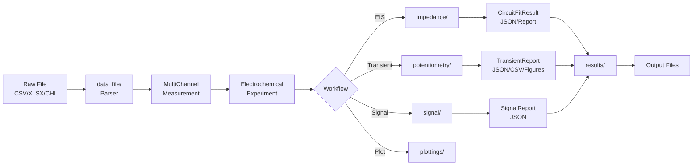
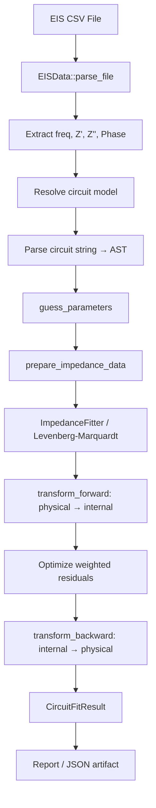

# 02 — Architecture

**Identifier:** `DOC-02`  
**Status:** Verified from repository inspection  
**Last Updated:** 2026-07-19

---

## 1. Overall Architecture

The system follows a **layered CLI-application architecture** with clear separation between:

1. **CLI Layer** — Argument parsing, legacy flag normalization, command dispatch
2. **Runner Layer** — Workflow coordination, configuration loading, output writing
3. **Domain Layer** — Shared data structures, errors, provenance, experiment model
4. **Scientific Core** — Equations, fitting, optimization, signal processing
5. **Data Layer** — File parsing, format detection, measurement construction
6. **Rendering Layer** — Plot generation via plotters

**Direction of dependency**: CLI → Runners → Domain + Scientific Core + Data → Rendering. Domain does **not** depend on rendering.

```mermaid
graph TD
    subgraph "CLI Layer"
        MAIN[main.rs]
        CLI[cli.rs]
    end
    
    subgraph "Runner Layer"
        R_PLOT[plot runner]
        R_FIT[fit runner]
        R_SEARCH[search runner]
        R_TRANSIENT[transient runner]
        R_CAL[calibration runner]
        R_MECH[mechanism runner]
        R_SIGNAL[signal runner]
        R_HEALTH[health runner]
        R_EST[estimation runner]
    end
    
    subgraph "Configuration"
        PLOT_CFG[plot_config.rs]
        SRCH_CFG[search_config.rs]
        TRANS_CFG[transient_config.rs]
        CAL_CFG[calibration_config.rs]
        MECH_CFG[mechanism_config.rs]
        SIG_CFG[signal_config.rs]
        HLTH_CFG[health_config.rs]
        EST_CFG[estimation_config.rs]
    end
    
    subgraph "Domain Layer"
        DOMAIN[domain/]
        RESULTS[results/]
        WORKSPACE[workspace.rs]
    end
    
    subgraph "Scientific Core"
        IMPEDANCE[impedance/]
        POTENT[potentiometry/]
        SIGNAL_CORE[signal/]
        HEALTH_CORE[health/]
        ESTIMATION[estimation/]
        MECHANISM[mechanism/]
        REGRESSION[regression_mod.rs]
    end
    
    subgraph "Data Layer"
        DATA_FILE[data_file/]
    end
    
    subgraph "Rendering"
        PLOTTINGS[plottings/]
    end
    
    MAIN --> CLI
    MAIN --> R_PLOT & R_FIT & R_SEARCH & R_TRANSIENT & R_CAL & R_MECH & R_SIGNAL & R_HEALTH & R_EST
    MAIN --> WORKSPACE
    
    R_PLOT --> PLOT_CFG
    R_SEARCH --> SRCH_CFG
    R_TRANSIENT --> TRANS_CFG
    R_CAL --> CAL_CFG
    R_MECH --> MECH_CFG
    R_SIGNAL --> SIG_CFG
    R_HEALTH --> HLTH_CFG
    R_EST --> EST_CFG
    
    R_PLOT --> DATA_FILE & PLOTTINGS
    R_FIT --> IMPEDANCE & DATA_FILE
    R_SEARCH --> IMPEDANCE & DATA_FILE
    R_TRANSIENT --> POTENT & DATA_FILE
    R_CAL --> POTENT
    R_MECH --> MECHANISM
    R_SIGNAL --> SIGNAL_CORE
    R_HEALTH --> HEALTH_CORE
    R_EST --> ESTIMATION
    
    R_PLOT & R_FIT & R_SEARCH & R_TRANSIENT & R_CAL & R_MECH & R_SIGNAL & R_HEALTH & R_EST --> RESULTS & DOMAIN
    DOMAIN --> DATA_FILE
    POTENT --> DOMAIN
    IMPEDANCE --> DOMAIN
```



## 2. Module Dependency Direction

```
CLI (main.rs, cli.rs)
 ├── Runners (runners/)
 │    ├── Domain (domain/)
 │    ├── Results (results/)
 │    ├── Data (data_file/)
 │    ├── Scientific Core
 │    │    ├── impedance/
 │    │    ├── potentiometry/
 │    │    ├── signal/
 │    │    ├── health/
 │    │    ├── estimation/
 │    │    ├── mechanism/
 │    │    └── regression_mod.rs
 │    └── Rendering (plottings/)
 └── Workspace (workspace.rs)
```

Domain depends on nothing except `serde`, `sha2`, `std`. Domain does **not** depend on plottings, cli, runners, or any scientific modules.

## 3. Data Flow



### Scientific Computation Flow (EIS Fit)



## 4. Control Flow (Main Dispatch)

```mermaid
flowchart TD
    START[main()] --> PARSE[parse_cli_args]
    PARSE --> HELP{Help/Version?}
    HELP -->|Yes| PRINT[Print and exit 0]
    HELP -->|No| CMD{Command?}
    CMD -->|None| USAGE[Print usage, exit 0]
    CMD -->|Some| WS[prepare_workspace]
    WS --> DISPATCH{Dispatch}
    DISPATCH -->|Plot| RUN_PLOT[plot::run]
    DISPATCH -->|EisFit| RUN_FIT[fit::run]
    DISPATCH -->|EisSearch| RUN_SRCH[search::run]
    DISPATCH -->|TransientFit| RUN_TRANS[transient::run]
    DISPATCH -->|Calibration*| RUN_CAL[calibration::*]
    DISPATCH -->|Mechanism*| RUN_MECH[mechanism::*]
    DISPATCH -->|Signal*| RUN_SIG[signal::*]
    DISPATCH -->|Health*| RUN_HLTH[health::*]
    DISPATCH -->|Estimate*| RUN_EST[estimation::*]
    RUN_PLOT & RUN_FIT & RUN_SRCH & RUN_TRANS & RUN_CAL & RUN_MECH & RUN_SIG & RUN_HLTH & RUN_EST --> RECORD[record_last_run]
    RECORD --> EXIT[Exit 0 or error]
```

## 5. Error Propagation

```mermaid
flowchart TD
    subgraph "Error Types"
        CE[ConfigurationError]
        DPE[DataParsingError]
        FE[FittingError]
        RE[ReportingError]
        WE[WorkspaceError]
        PLE[PlottingError]
        PE[PotentiometryError]
        CE_L[CalibrationError]
        SE[SignalError]
        HE[HealthError]
        EE[EstimationError]
    end
    
    CE & DPE & FE & RE & WE & PLE & PE & CE_L & SE & HE & EE --> RUNNER[RunnerError]
    RUNNER --> APP[ApplicationError]
    APP --> MAIN[main(): eprintln + exit(1)]
    
    DPE --> CE
    DPE --> FE
    FE --> RE
    PLE --> FE
    WE --> CE
```

## 6. External Library Boundaries

| Library | Purpose | Module Boundary |
|---------|---------|-----------------|
| `clap` | CLI argument parsing | `cli.rs` only |
| `plotters`, `image` | Figure rendering and image encoding | `plottings/` only |
| `levenberg-marquardt` | Nonlinear least squares | `impedance/`, `potentiometry/transient/fitting.rs` |
| `nalgebra` | Matrix/vector linear algebra | `impedance/`, `potentiometry/calibration/`, `potentiometry/transient/`, `estimation/` |
| `nom` | Circuit string parser | `impedance/circuits.rs` only |
| `num-complex` | Complex arithmetic | `impedance/`, `signal/psd.rs` |
| `genevo` | Genetic algorithm for ECM | `impedance/ecm_evolution.rs` only |
| `rayon` | Parallel candidate evaluation | `impedance/ecm_evolution.rs`, `impedance/pinn_optimizer.rs`, `impedance/lib.rs` |
| `rustfft` | FFT for signal PSD | `signal/psd.rs` only |
| `calamine` | Excel .xlsx reading | `data_file/excel_file.rs` only |
| `sha2` | File hashing for provenance | `domain/provenance.rs` only |
| `serde` / `serde_json` | Serialization and artifact I/O | Domain, config, runners, scientific modules, `results/` |
| `thiserror` | Error derive macros | CLI, domain, runners, scientific modules |
| `toml` | Configuration and manifest parsing | Config modules, `workspace.rs`, `impedance/circuit_models.rs`, `mechanism/matching.rs`, `signal/comparison.rs` |
| `csv` | CSV reading and export pipelines | `runners/`, `estimation/validation.rs` |
| `rand` | Simulation and uncertainty sampling | `estimation/simulation.rs`, `potentiometry/transient/`, `potentiometry/calibration/uncertainty.rs` |

Boundary mappings above were rebuilt from direct external-crate import usage in `src/**/*.rs`.

## 7. Architectural Boundaries and Observations

### Well-Defined Boundaries (✅)
- Domain ↔ Rendering: zero dependency from domain to plottings
- CLI ↔ Scientific: only through runner layer
- Configuration ↔ Logic: config structs are validated at load time
- Results ↔ Rendering: results are data-only, rendering consumes them

### Implicit or Undesirable Coupling (⚠️)
- `src/lib.rs` re-exports `rust_plots` as `extern crate self as rust_plots` — a historical naming artifact. Internal aliases reference `rust_plots` but the crate is `rust_electroanalysis_cli`.
- `plottings/` modules contain some `unwrap()` calls on data points (e.g., `estimation_plot.rs`, `signal_plot.rs`, `health_plot.rs`) that could panic on empty data.
- `workspace.rs` contains embedded default configuration constants that duplicate information from the actual config files.
- The `fitting::mod.rs` facade delegates directly to `impedance::` — this is intentional but creates an extra indirection layer.

### Circular Conceptual Dependencies
- None detected. All dependencies form a DAG.

### Cross-Cutting Concerns
- **Provenance**: Injected at the domain boundary (`ElectrochemicalExperiment`, `CalibrationObservationSet`) and threaded through results
- **Configuration**: Each workflow has its own config module, resolved independently
- **Serialization**: All result types implement `Serialize`/`Deserialize` via serde
