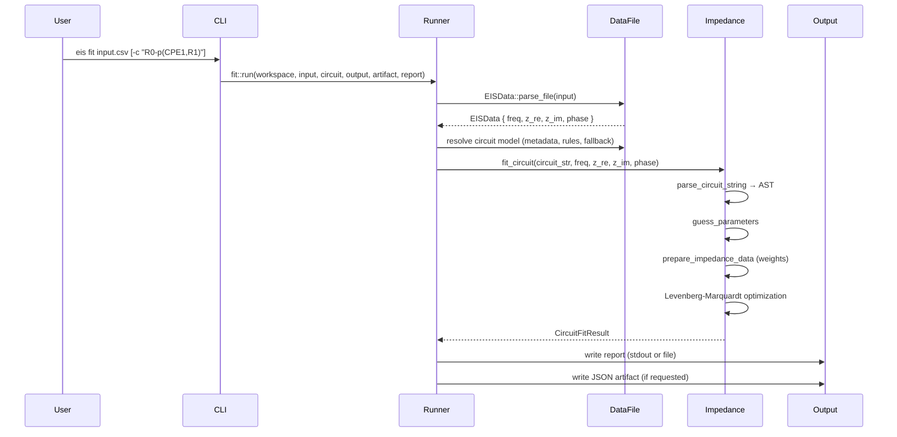
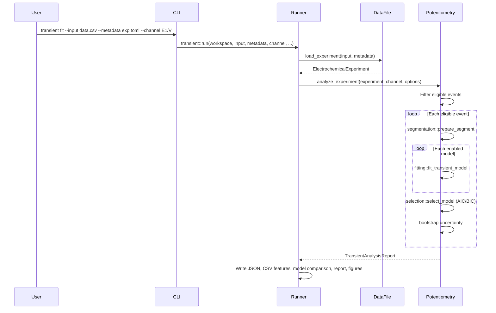
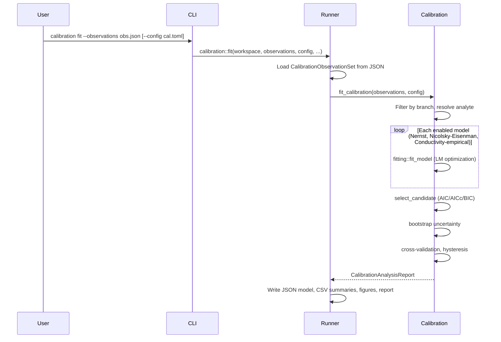
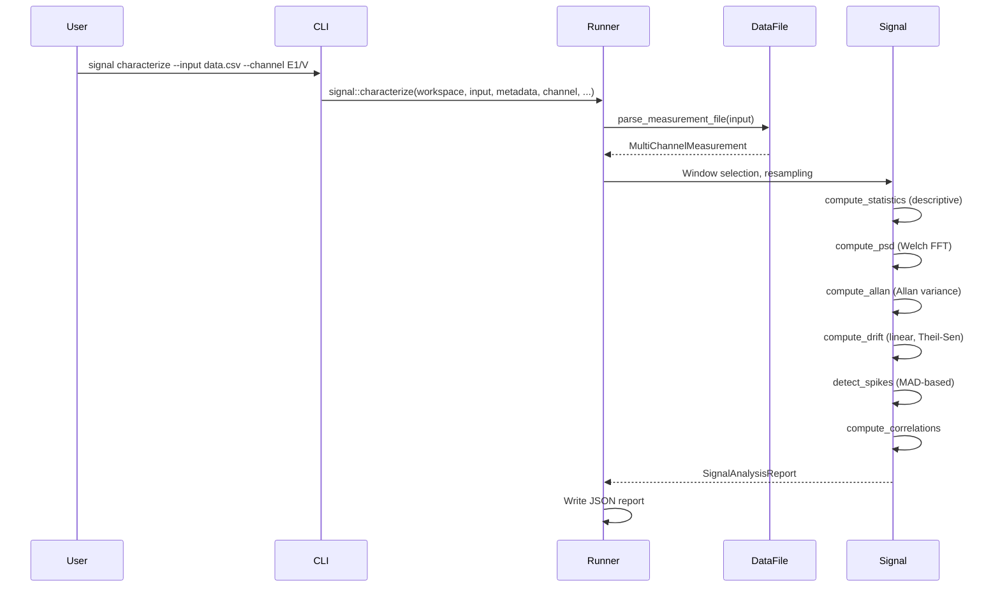
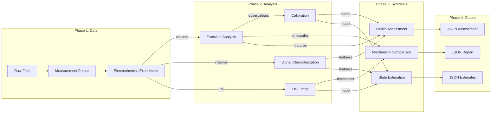

# 06 — Workflows

**Identifier:** `DOC-06`  
**Status:** Verified from repository inspection  
**Last Updated:** 2026-07-19

---

## Workflow Inventory

| ID | Workflow | CLI Command | Runner | Scientific Module |
|----|----------|------------|--------|-------------------|
| WF-001 | EIS Plotting | `plot eis` | `runners/plot.rs` | `plottings/eis_plot.rs` |
| WF-002 | Regular (CHI) Plotting | `plot regular-plot` | `runners/plot.rs` | `plottings/chi_plot.rs` |
| WF-003 | Generic Plotting | `plot generic-plot` | `runners/plot.rs` | `plottings/generic_plot.rs` |
| WF-004 | EIS Circuit Fitting | `eis fit` | `runners/fit.rs` | `impedance/` |
| WF-005 | ECM Search | `eis search` | `runners/search.rs` | `impedance/ecm_evolution.rs` |
| WF-006 | EIS Fit Export | `eis export-fit` | `runners/fit.rs` | `impedance/` |
| WF-007 | Transient Analysis | `transient fit` | `runners/transient.rs` | `potentiometry/transient/` |
| WF-008 | Calibration Extraction | `calibration extract` | `runners/calibration.rs` | `potentiometry/calibration/observations.rs` |
| WF-009 | Calibration Fitting | `calibration fit` | `runners/calibration.rs` | `potentiometry/calibration/` |
| WF-010 | Calibration Validation | `calibration validate` | `runners/calibration.rs` | `potentiometry/calibration/validation.rs` |
| WF-011 | Calibration Prediction | `calibration predict` | `runners/calibration.rs` | `potentiometry/calibration/prediction.rs` |
| WF-012 | Mechanism Comparison | `mechanism compare` | `runners/mechanism.rs` | `mechanism/` |
| WF-013 | Mechanism Trending | `mechanism trend` | `runners/mechanism.rs` | `mechanism/trend.rs` |
| WF-014 | Signal Characterization | `signal characterize` | `runners/signal.rs` | `signal/` |
| WF-015 | Signal Comparison | `signal compare` | `runners/signal.rs` | `signal/comparison.rs` |
| WF-016 | Residual Analysis | `signal residuals` | `runners/signal.rs` | `signal/residuals.rs` |
| WF-017 | Health Baseline | `health baseline` | `runners/health.rs` | `health/baseline.rs` |
| WF-018 | Health Assessment | `health assess` | `runners/health.rs` | `health/assessment.rs` |
| WF-019 | Health Trending | `health trend` | `runners/health.rs` | `health/trend.rs` |
| WF-020 | State Estimation | `estimate run` | `runners/estimation.rs` | `estimation/` |
| WF-021 | Estimation Validation | `estimate validate` | `runners/estimation.rs` | `estimation/validation.rs` |
| WF-022 | Estimation Simulation | `estimate simulate` | `runners/estimation.rs` | `estimation/simulation.rs` |
| WF-023 | Filter Comparison | `estimate compare` | `runners/estimation.rs` | `estimation/comparison.rs` |

---

## WF-004: EIS Circuit Fitting

### Sequence


### Preconditions
- Input file exists and is valid CHI EIS format
- Circuit expression is parseable (or resolved from metadata/rules)
- Frequency, Z′, and Z″ vectors are non-empty and length-aligned
- At least 3 valid impedance rows remain after preprocessing (finite values, f > 0)

### Outputs
- Fit report (stdout or file): parameter values, confidence, goodness-of-fit
- JSON artifact (if `--artifact`): durable `FitCircuitResult`
- Human-readable report (if `--report`)

---

## WF-005: ECM Search

### Sequence
```mermaid
sequenceDiagram
    participant User
    participant CLI
    participant Runner
    participant DataFile
    participant Impedance
    
    User->>CLI: eis search input/ [--search-top 5]
    CLI->>Runner: search::run(workspace, input, config, output, top)
    Runner->>DataFile: Load EIS file(s)
    loop Each file or directory
        Runner->>Impedance: run_ecm_evolution(data, config)
        Impedance->>Impedance: Seed circuit population
        loop Each generation
            Impedance->>Impedance: Evaluate ranking objective (BIC default; configurable)
            Impedance->>Impedance: Selection, crossover, mutation
            Impedance->>Impedance: Reinsertion
        end
        Impedance-->>Runner: Ranked candidates
    end
    Runner->>Runner: Write ranked report + plots
```

### Preconditions
- Analysis config exists or defaults apply
- Input file/directory contains valid EIS data

### Default objective and mutation settings
- Ranking criterion defaults to `bic` when not explicitly set in search config.
- Mutation rate default is `0.35` (workspace template and `EcmEvolutionConfig::default()`).

### Outputs
- Ranked candidate list (CSV/text)
- ECM plots for top-N candidates
- Search summary report

---

## WF-007: Transient Analysis

### Sequence


### Timestamp policy behavior (WF-007 transient)

| Config field | Default | Behaviour |
|--------------|---------|-----------|
| `segmentation.duplicate_timestamp_policy` | `error` | Rejects duplicate groups (`DuplicateTimestamps` error). |
| `segmentation.duplicate_timestamp_policy` | `average` | Averages each duplicate group before fitting. |
| `segmentation.non_monotonic_policy` | `sort` | Sorts paired rows by timestamp before fitting. |
| `segmentation.non_monotonic_policy` | `error` | Rejects non-monotonic timestamps (`NonMonotonicTimestamps` error). |
| `segmentation.irregular_sampling_policy` | `allow` | Continues with actual timestamps and emits irregular-sampling warning. |
| `segmentation.irregular_sampling_policy` | `error` | Rejects irregular sampling window. |

---

## WF-009: Calibration Fitting

### Sequence


---

## WF-014: Signal Characterization

### Sequence


### Timestamp policy behavior (WF-014 signal)

| Config field | Default | Behaviour |
|--------------|---------|-----------|
| `sampling.duplicate_timestamp_policy` | `error` | Rejects duplicate timestamp groups. |
| `sampling.duplicate_timestamp_policy` | `average` | Resolves each duplicate group to mean finite value. |
| `sampling.duplicate_timestamp_policy` | `first` | Resolves each duplicate group to first value. |
| `sampling.duplicate_timestamp_policy` | `last` | Resolves each duplicate group to last value. |
| `sampling.non_monotonic_timestamp_policy` | `error` | Rejects non-monotonic timestamps. |
| `sampling.non_monotonic_timestamp_policy` | `sort_paired` | Stably sorts paired `(time, value)` rows before duplicate resolution. |

---

## Cross-Workflow Data Flow



## Workflow Output Artifact Matrix (Code-Verified)

This matrix is the workflow-level artifact reference for Stage 3 completeness.  
Config-driven filenames are shown with their default values from each resolved config.

| ID | Workflow | Default output root | Artifacts (default names/patterns) |
|----|----------|---------------------|------------------------------------|
| WF-001 | `plot eis` | Plot job `output_dir` from `plot` config | Per-dataset base `<base>`: `_nyquist`, `_nyquist_comparison`, `_nyquist_overlay`, `_bode_magnitude`, `_bode_magnitude_comparison`, `_bode_phase`, `_bode_phase_comparison` as `.svg` + `.png`; text fit report `<base>_fit_report.txt`; combined base `<output_dir>/combined/<prefix_all>` with `_nyquist`, `_bode_magnitude`, `_bode_phase` as `.svg` + `.png`. |
| WF-002 | `plot regular-plot` | Plot job `output_dir` from `plot` config | Individual base under `<output_dir>/individual/` and combined overlay base under `<output_dir>/combined/`; all rendered as `.svg` + `.png` pairs from base path. Multi-column single-file mode adds `<prefix_stem>_overlay` combined base. |
| WF-003 | `plot generic-plot` | Plot job `output_dir` from `plot` config | Individual base under `<output_dir>/individual/` and combined overlay base under `<output_dir>/combined/`; all rendered as `.svg` + `.png` pairs from base path (including selection/aggregation modes). |
| WF-004 | `eis fit` | No default file output unless path flags are used | stdout fit report by default; optional `--output` text report; optional `--artifact` JSON (`EisFitArtifact`); optional `--report` human-readable artifact report text. |
| WF-005 | `eis search` | Report defaults beside input; plot root from search config or input stem | Text ranking report `<stem>_ecm_search.txt` + CSV `<stem>_ecm_search.csv`; optional top-N plot base `<stem>_ecm_search_top_models` (or configured dir) with `_nyquist_overlay`, `_bode_magnitude_overlay`, `_bode_phase_overlay` and rank bases `_rank_XX_*` as `.svg` + `.png`; multi-input combined overlay base `combined/ecm_search_all_datasets` as `.svg` + `.png`. |
| WF-006 | `eis export-fit` | Caller-provided artifact path | Required JSON artifact path; optional human-readable report path. |
| WF-007 | `transient fit` | `output/` (or caller-provided directory) | Config-driven exports: `transient_results.json`, `transient_features.csv`, `transient_model_comparison.csv`, `transient_report.txt`; optional event plots when enabled: `transient_event_<index>_response.{svg,png}`, optional residuals and model-comparison `.svg/.png` pairs. |
| WF-008 | `calibration extract` | `output/calibration` (or caller-provided path) | Observation JSON at config-driven `observations_filename` (default `calibration_observations.json`). |
| WF-009 | `calibration fit` | `output/calibration` | Config-driven exports: `calibration_model.json`, `calibration_results.json`, `calibration_summary.csv`, `calibration_residuals.csv`, `calibration_validation.csv`, `calibration_report.txt`; optional calibration plots when enabled as `.svg/.png` pairs (`calibration_potential_vs_activity`, `..._concentration`, `..._theoretical_slope`, `..._residuals`, `..._branches`, optional `..._hysteresis`, optional `..._validation`). |
| WF-010 | `calibration validate` | `output/calibration` | Fixed outputs: `calibration_validation_results.json`, `calibration_validation.csv`, `calibration_validation_report.txt`. |
| WF-011 | `calibration predict` | Workspace root (default) | Default `prediction.json`; if output extension is `.csv`, writes tabular prediction CSV instead; JSON output is single object for single-potential mode or array for batch mode. |
| WF-012 | `mechanism compare` | `output/mechanism` | Fixed outputs: `mechanism_results.json`, `characteristic_timescales.csv`, `timescale_comparisons.csv`, `mechanism_trends.csv`, `mechanism_report.txt`; mechanism plots: `timescale_map.{svg,png}` (when timescale points exist) and `timescale_ratio.{svg,png}` (when ratio points exist). |
| WF-013 | `mechanism trend` | `output/mechanism` | Same export set and plotting behavior as WF-012 via shared `export_report`. |
| WF-014 | `signal characterize` | `output/signal` | Config-driven exports: `signal_results.json`, `signal_summary.csv`, `signal_psd.csv`, `signal_allan.csv`, `signal_drift.csv`, `signal_spikes.csv`, `signal_correlations.csv`, `signal_report.txt`; optional plots when enabled are PNG-only (`signal_raw.png`, `signal_sampling_interval.png`, optional `signal_psd.png`, `signal_asd.png`, `signal_allan.png`, `signal_spike_flags.png`, `signal_cross_correlation_<i>.png`). |
| WF-015 | `signal compare` | `output/signal_comparison` | Fixed outputs: `signal_comparison_results.json`, `signal_comparison.csv`, `signal_comparison_provenance.json`. |
| WF-016 | `signal residuals` | `output/residual_analysis` | Fixed outputs: `residual_analysis_results.json`, `residual_analysis_report.txt`. |
| WF-017 | `health baseline` | `output/health` (unless explicit file path provided) | Baseline JSON at config-driven `baseline_filename` (default `health_baseline.json`). |
| WF-018 | `health assess` | `output/health` | Config-driven exports: `health_assessment.json`, `health_features.csv`, `health_findings.csv`, `health_report.txt`; optional PNG plot `health_feature_deviations.png` when plotting is enabled. |
| WF-019 | `health trend` | `output/health_trend` | JSON trend report at config-driven `trends_filename` (default `health_trends.csv`) and fixed CSV `health_trends.csv`; no automatic trend-plot invocation in runner. |
| WF-020 | `estimate run` | `output/estimation` | Config-driven exports: `state_estimation.json`, `state_diagnostics.json`, `state_validation.json`, `state_estimates.csv`, `state_innovations.csv`, `state_estimation_report.txt`; optional PNG plots when enabled (`estimated_potential.png`, `estimated_activity.png`, optional state traces, `estimated_innovations.png`, `estimated_nis.png`). |
| WF-021 | `estimate validate` | `output/estimation_validation` | Fixed outputs: `state_validation.json`, `state_validation_report.txt`. |
| WF-022 | `estimate simulate` | `output/estimation_simulation` | Fixed outputs: `simulation.json`, `simulation_calibration_model.json`, `simulation_measurements.csv`, `simulation_truth.csv`. |
| WF-023 | `estimate compare` | `output/estimation_comparison` | Fixed outputs: `state_filter_comparison.json`, `state_filter_comparison_report.txt`. |

## Failure Conditions

| Workflow | Failure | Behaviour |
|----------|---------|-----------|
| All | Missing required input file | Error with path, exit 1 |
| All | Invalid configuration | Error with field description, exit 1 |
| EIS Fit | Empty frequency vector | Invalid input error: "frequencies cannot be empty" |
| EIS Fit | <3 valid rows after impedance preprocessing | Invalid input error: "not enough valid impedance points after preprocessing" |
| EIS Fit | Unparseable circuit string | CircuitParse error |
| EIS Fit | Optimizer convergence failure | Optimizer error with diagnostics |
| ECM Search | No valid candidates found | Empty search result (not an error) |
| Transient | Duplicate timestamps with policy `error` | `DuplicateTimestamps` error |
| Transient | No eligible events | NoEligibleEvents error |
| Transient | All models failed | AllModelsFailed warning in report |
| Calibration | <2 distinct activity levels | Warning (not error) |
| Calibration | All models failed | AllModelsFailed error |
| Signal | Duplicate timestamps with policy `error` | Sampling error |
| Signal | Empty window | EmptyWindow error |
