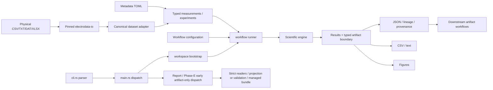

# Architecture and module reference

[Master manual](../USER_MANUAL.md) · [Coverage audit](../USER_MANUAL_COVERAGE.md)

The application separates physical input recognition, experiment meaning, analysis, artifact contracts and presentation. A scientific runner coordinates these layers; it does not make every downstream artifact independent evidence.

## Repository map

| Directory / file | Responsibility and important files | Inputs → outputs / CLI relationship |
|---|---|---|
| Cargo.toml / Cargo.lock | Package/version, dependency contract and resolved graph; Git-pinned electrodata-io | Build input → executable/library; lockfile is part of reproducibility |
| rust-toolchain.toml | Rust 1.97.0 and development components | Build-tool selection; not model configuration |
| README.md / CHANGELOG.md | Project entry point and historical release notes | Secondary evidence; discrepancies are recorded, not silently reconciled |
| config/ | 11 workflow/state TOMLs and one public embedded trust-store JSON | Settings/default templates → loader/runner behavior |
| data/ | Default input directory | Raw datasets, if the researcher uses this layout |
| output/ | Default destination for many analyses | JSON/CSV/text/figures; not universal (search/prediction have exceptions) |
| logs/ | Workspace location created by bootstrap | Directory creation does not imply every command writes a log file |
| src/cli.rs | Clap tree, arguments/enums and legacy normalization | argv → normalized CommandSpec; all routes |
| src/main.rs | Early artifact-only routes, workspace bootstrap and runner dispatch | CommandSpec → workflow; prints application errors and nonzero status |
| src/lib.rs | Public module/typed-result exports and compatibility names | Library API; historical rust_plots references do not rename the current binary |
| src/workspace.rs | Config templates, directories, legacy migration, app last-run state | Working directory → workspace; ordinary analyses |
| src/domain/ | experiment.rs, measurement.rs, metadata.rs, diagnostics.rs, provenance.rs, artifact.rs, lineage.rs, errors.rs | Scientific measurement identity, units/optional values, hashing, typed read/write, ancestry and errors; shared workflows |
| src/data_file/ | electrodata_domain_adapter.rs, measurement_parser.rs, chi_file.rs, data_op.rs, value_transform.rs, excel_file.rs, input_kind.rs | Provider Dataset → domain measurements/EIS/PlotData; compatibility façades, no new independent physical parser |
| src/runners/ | fit/search/plot/transient/calibration/mechanism/signal/health/estimation/model/model_validation/report/mhi_validation, plus evidence | Load inputs/config, call engines, write artifacts/tables/plots. Command reference traces each route |
| src/impedance/ | circuits.rs/elements.rs, fitting.rs, circuit_models.rs, ecm_candidate/evolution/scoring/search, pinn_optimizer.rs, reporting.rs | Complex EIS → circuit fits/candidate rankings; eis and EIS plotting |
| src/potentiometry/transient/ | segmentation.rs, models.rs, fitting.rs, selection.rs, diagnostics.rs | Event windows → model candidates/features/uncertainty; transient fit |
| src/potentiometry/calibration/ | observations, activity, ionic_strength, environment, nernst, nicolsky_eisenman, fitting, uncertainty, validation, prediction | Known standards → observations/model/predictions; calibration and estimation observation adapter |
| src/potentiometry/units.rs | Typed quantities, supported units and explicit conversions | Scientific quantities → compatible units/errors; time/voltage/concentration/temperature consumers |
| src/mechanism/ | timescale/trend plus config/preparation/evidence/temporal/evaluation/promotion/history/identifiability/amplitude/repeatability/validation | EIS/transient and optional other artifacts → compatibility/hypothesis evidence; legacy and Phase-B paths |
| src/signal/ | sampling/windows/statistics/psd/allan/drift/spikes/correlation/residuals/comparison | Time series or fit residuals → signal diagnostics; signal commands, health and estimation inputs |
| src/health/ | features/baseline/normalization/rules/assessment/trend/evidence/phase_c | Comparable domain evidence → baseline/assessment/trends; legacy and Phase-C routes |
| src/estimation/ | model/process/initialization/environment/timestamp, ekf/ukf, innovation/validation/simulation/comparison, calibration_adapter/ism_adapter/model_adapter | Potential + calibration/model/prior → latent state trajectories and validation; estimate commands |
| src/estimation/model_adapter/ | backend/profile/state/input/output/covariance bindings | Explicit compiled-model contracts shared by filters; no implicit custom input invention |
| src/model/ | definition/compiler/registry/builtins/defaults, component/state/parameter/input/output, graph/evidence/validity/identifiability/equilibrium_recognition | Typed component model → compiled model and evaluated contributions; model commands/compiled estimation |
| src/results/ | Per-domain serialized types and artifact_contracts.rs | Domain outputs → stable artifact schemas; typed readers/writers gate cross-workflow use |
| src/evidence.rs / evidence_adapters.rs | Evidence bundle/record/source/target conversion and covariance semantics | Typed artifacts → prepared evidence with explicit lineage/independence limitations |
| src/reporting/ | document/figures/tables, projection and lineage/report contracts | Frozen artifacts → Phase-D summaries, figures and provenance tables |
| src/mhi_validation/ | protocol/reader/partition/statistics/evaluation/approval/output/error | Frozen cohort/reference/authority inputs → Phase-E report/bundle; validation run |
| src/*_config.rs | Separate workflow loaders, defaults, migration and validation | Selected TOML → resolved analysis settings; no universal config overlay |
| src/model_validation.rs | Study-manifest evaluation | Model-analysis artifacts + study metadata → validation metrics; model validate --manifest |
| src/fitting/ / regression_mod.rs | General fitting/regression helpers | Selected plot points → supported regression overlays; distinct from full calibration models |
| src/plottings/ | EIS, regular/generic and dedicated scientific plot writers | Typed results/series → raster/vector figures; writer-specific availability/format |
| src/plot_runner.rs / search_runner.rs | Legacy-compatible physical input batch orchestration | Candidate paths → per-file results, figures and partial-failure summaries |
| tests/ | Integration contracts across phases, ingestion, models, scientific calculations and CLI | Synthetic/fixture inputs → regression/conformance checks, not physical authority |
| tests/fixtures/ | CHI/general/XLSX, EIS, transient, legacy schemas, Phase A/B/C/D/E inputs | Small checked-in examples and negative cases; many require setup performed by tests |
| examples/model/ | Model examples | Explicit model definitions/scenarios; use with matching route/schema |
| docs/model/ | Reduced-order model descriptions/plans | Separate implemented equations from future planning |
| docs/adr/, releases/, reviews/ | Architecture decisions, delivery notes and audit history | Historical context; not replacements for runtime contracts |
| docs/engineering_specification/ | Phase plans/contracts and Phase-F R11/R12 governance specifications | Normative intent and traceability; no automatic REAL approval |
| scripts/ | Development/verification tooling | Maintenance utilities, not additional Clap CLI commands |
| .github/workflows/ | Rust CI matrix | Ubuntu/macOS fmt/clippy/tests/release checks; no Windows matrix in current workflow |
| plot_config.*.toml | Extended styling/job examples at repository root | Consult against current parser; legacy examples can be stale |

The code may expose functions that have no CLI route. For example, a plotting helper or smoothing module being present does not establish a `health trend --plot` or smoothing command. The complete CLI inventory is defined by cli.rs and dispatch, not by the number of source files.

## Integration and maintenance boundaries

Raw data ingestion preserves source coordinate/order/unit diagnostics; scientific engines decide when to normalize, sort, segment or resample. Artifact readers are a different boundary from physical data readers. Calling a JSON artifact a dataset does not make it acceptable to the CSV/XLSX ingestion API.

Report and Phase-E validation dispatch before workspace bootstrap. They read declared artifacts and use stricter managed publication/output rules. “Publication” in that code means writing a local bundle under an authorized path; it is not uploading to a journal/server or granting Phase-F REAL authority.

There is no executable plugin DSL for new transport equations in TOML. Component kinds resolve against the compiled registry. Adding an equation requires implementation and scientific validation outside this documentation task. Public metadata and local configuration cannot invent supported physics.

## Implementation-specific limitations

- ECM evolution is bounded and stochastic; multiple circuits can fit similarly.
- Transient candidate families have one or two exponential modes (or stretched response), not arbitrary process-count discovery.
- Independent-error fitting/bootstrap assumptions can fail with correlated/nonstationary data.
- Calibration activity models require explicit units/composition/coefficients and finite validity domains.
- Estimation is offline and model-dependent; no general live acquisition/control command is present.
- Compiled reduced ISM models do not implement a high-fidelity Nernst–Planck solver.
- Source presence of GPU-like terminology is not a supported GPU CLI feature; the current build does not declare a GPU backend dependency/flag.
- CI declares Linux/macOS jobs, not Windows coverage. This is a coverage statement, not proof that Windows cannot compile.
- Several accepted configuration fields are retained for compatibility/intention but are not fully consumed by current runners. Known instances and runtime pitfalls are documented in configuration and coverage.
- Health trend summary slopes and output-file collision are unresolved; use point CSVs and a distinct JSON filename as documented.
