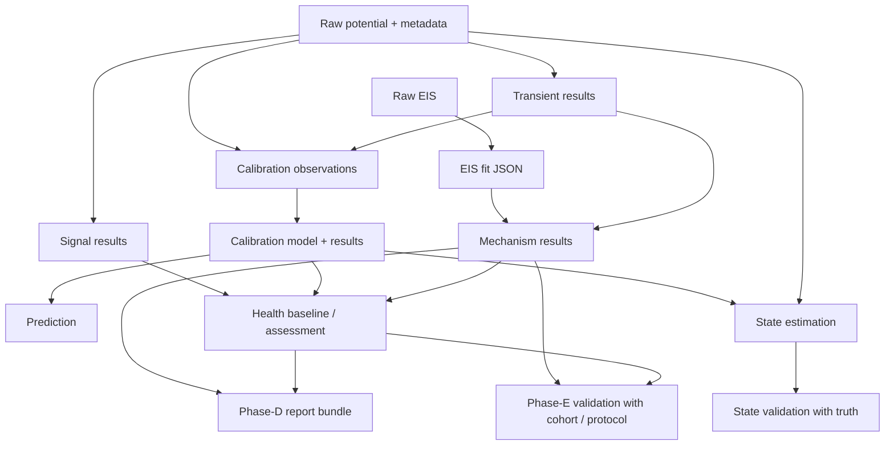

# Output artifacts and JSON field guide

[Master manual](../USER_MANUAL.md) · [Commands](command_reference.md) · [Workflows](workflows.md)

## Reading the inventory

Paths are relative to the working directory unless described otherwise. Export config can rename normal analysis files. Empty CSV tables or JSON null/unavailable fields mean missing/unsupported evidence, not zero. Ordinary writers can overwrite files; report/validation have separate managed-bundle preflight rules. Listed figure patterns are conditional, not a promise that every run produces every figure.

## plot

Producer: [`plot`](command_reference.md#plot). Default destination: **Configured output_path, shipped output/**.

| File / pattern | Format | Meaning / next consumer |
|---|---|---|
| `<prefix><stem>_nyquist.{png,svg}` | PNG/SVG | Configured EIS and regular/generic figures; data-dependent base names and overlay suffixes. See exact naming notes below. |
| `<prefix><stem>_bode_magnitude.{png,svg}` | PNG/SVG | Same export family; see explanation below. |
| `<prefix><stem>_bode_phase.{png,svg}` | PNG/SVG | Same export family; see explanation below. |
| `<prefix><stem>_fit_report.txt` | text | Same export family; see explanation below. |
| `<prefix><stem>_nyquist_comparison.{png,svg}` | PNG/SVG | Measured/fitted comparison when fitting produces usable curves. |
| `<prefix><stem>_nyquist_overlay.{png,svg}` | PNG/SVG | Available Nyquist overlay. |
| `<prefix><stem>_bode_magnitude_comparison.{png,svg}` | PNG/SVG | Measured/fitted magnitude comparison. |
| `<prefix><stem>_bode_phase_comparison.{png,svg}` | PNG/SVG | Measured/fitted phase comparison. |
| `individual/*` | See description | Same export family; see explanation below. |
| `combined/*` | See description | Same export family; see explanation below. |

Configured EIS and regular/generic figures; data-dependent base names and overlay suffixes. See exact naming notes below.

**Next use:** Human inspection/publication.

## eis fit

Producer: [`eis fit`](command_reference.md#eis-fit). Default destination: **stdout; optional user-chosen paths**.

| File / pattern | Format | Meaning / next consumer |
|---|---|---|
| `--output PATH` | See description | Ordinary fit text, EIS JSON schema 3, and artifact text respectively. No default JSON path. |
| `--artifact PATH` | See description | Same export family; see explanation below. |
| `--report PATH` | See description | Same export family; see explanation below. |

Ordinary fit text, EIS JSON schema 3, and artifact text respectively. No default JSON path.

**Next use:** JSON → mechanism compare, signal residuals, health assess, estimate run, model decompose, report render.

## eis export-fit

Producer: [`eis export-fit`](command_reference.md#eis-export-fit). Default destination: **Required explicit --artifact path**.

| File / pattern | Format | Meaning / next consumer |
|---|---|---|
| `--artifact PATH` | See description | Same schema-3 EIS fit artifact and optional text; ordinary fit also prints to stdout. |
| `--report PATH` | See description | Same export family; see explanation below. |

Same schema-3 EIS fit artifact and optional text; ordinary fit also prints to stdout.

**Next use:** Same as eis fit.

## eis search

Producer: [`eis search`](command_reference.md#eis-search). Default destination: **Beside each input by default; --search-output overrides**.

| File / pattern | Format | Meaning / next consumer |
|---|---|---|
| `<input-identity>_ecm_search.txt` | text | Full candidate report, ranked table, optional ranked overlays/individual figures. A raw .csv input commonly becomes stem__csv in identity. |
| `<input-identity>_ecm_search.csv` | CSV | Same export family; see explanation below. |
| `<plot-base>*.{png,svg}` | PNG/SVG | Same export family; see explanation below. |

Full candidate report, ranked table, optional ranked overlays/individual figures. A raw .csv input commonly becomes stem__csv in identity.

**Next use:** Choose circuit and run eis fit/export-fit; search CSV is not an EisFitArtifact.

## transient fit

Producer: [`transient fit`](command_reference.md#transient-fit). Default destination: **output/**.

| File / pattern | Format | Meaning / next consumer |
|---|---|---|
| `transient_results.json` | JSON | Schema-3 event/candidate result, selected response descriptors, candidate comparison and text. Figures conditional on selected fit/plot flags. |
| `transient_features.csv` | CSV | Same export family; see explanation below. |
| `transient_model_comparison.csv` | CSV | Same export family; see explanation below. |
| `transient_report.txt` | text | Same export family; see explanation below. |
| `transient_event_<index>_response.{png,svg}` | PNG/SVG | Same export family; see explanation below. |
| `transient_event_<index>_residuals.{png,svg}` | PNG/SVG | Same export family; see explanation below. |
| `transient_event_<index>_model_comparison.{png,svg}` | PNG/SVG | Same export family; see explanation below. |

Schema-3 event/candidate result, selected response descriptors, candidate comparison and text. Figures conditional on selected fit/plot flags.

**Next use:** JSON → calibration extract, mechanism, signal residuals, health, estimate, model, report.

## calibration extract

Producer: [`calibration extract`](command_reference.md#calibration-extract). Default destination: **output/calibration/; output with extension is a file**.

| File / pattern | Format | Meaning / next consumer |
|---|---|---|
| `calibration_observations.json` | JSON | Schema-3 observation set including activity/temperature/source/warnings. |

Schema-3 observation set including activity/temperature/source/warnings.

**Next use:** calibration fit/validate; Phase-B/Phase-D observation evidence.

## calibration fit

Producer: [`calibration fit`](command_reference.md#calibration-fit). Default destination: **output/calibration/**.

| File / pattern | Format | Meaning / next consumer |
|---|---|---|
| `calibration_model.json` | JSON | Stored model schema 3, candidate analysis schema 3, observation/fit summary, residuals, optional validation rows and report. |
| `calibration_results.json` | JSON | Same export family; see explanation below. |
| `calibration_summary.csv` | CSV | Same export family; see explanation below. |
| `calibration_residuals.csv` | CSV | Same export family; see explanation below. |
| `calibration_validation.csv` | CSV | Same export family; see explanation below. |
| `calibration_report.txt` | text | Same export family; see explanation below. |

Stored model schema 3, candidate analysis schema 3, observation/fit summary, residuals, optional validation rows and report.

**Next use:** Model → predict, validate, estimate, model decompose; analysis → signal/health/mechanism/report.

## calibration validate

Producer: [`calibration validate`](command_reference.md#calibration-validate). Default destination: **output/calibration/**.

| File / pattern | Format | Meaning / next consumer |
|---|---|---|
| `calibration_validation_results.json` | JSON | Unversioned validation payload, per-prediction table and readable validation summary. |
| `calibration_validation.csv` | CSV | Same export family; see explanation below. |
| `calibration_validation_report.txt` | text | Same export family; see explanation below. |

Unversioned validation payload, per-prediction table and readable validation summary.

**Next use:** Researcher; not a stored calibration model.

## calibration predict

Producer: [`calibration predict`](command_reference.md#calibration-predict). Default destination: **prediction.json in working directory**.

| File / pattern | Format | Meaning / next consumer |
|---|---|---|
| `prediction.json OR user-chosen .csv` | CSV | One prediction object for scalar/single result or batch prediction collection; .csv suffix selects CSV writer. |

One prediction object for scalar/single result or batch prediction collection; .csv suffix selects CSV writer.

**Next use:** Researcher/external downstream analysis.

## mechanism compare

Producer: [`mechanism compare`](command_reference.md#mechanism-compare). Default destination: **output/mechanism/**.

| File / pattern | Format | Meaning / next consumer |
|---|---|---|
| `mechanism_results.json` | JSON | Current writer schema 4 even for legacy comparison payload; characteristic quantities/derivations and pair evidence, trends (possibly empty), text and figures. |
| `characteristic_timescales.csv` | CSV | Same export family; see explanation below. |
| `timescale_comparisons.csv` | CSV | Same export family; see explanation below. |
| `mechanism_trends.csv` | CSV | Same export family; see explanation below. |
| `mechanism_report.txt` | text | Same export family; see explanation below. |
| `timescale_map.{png,svg}` | PNG/SVG | Same export family; see explanation below. |
| `timescale_ratio.{png,svg}` | PNG/SVG | Same export family; see explanation below. |

Current writer schema 4 even for legacy comparison payload; characteristic quantities/derivations and pair evidence, trends (possibly empty), text and figures.

**Next use:** health, estimate, report render, Phase-B prior history; Phase-E only compatible scoreable evidence.

## mechanism trend

Producer: [`mechanism trend`](command_reference.md#mechanism-trend). Default destination: **output/mechanism/**.

| File / pattern | Format | Meaning / next consumer |
|---|---|---|
| `mechanism_results.json` | JSON | Same export family, with manifest-derived records and trends. |
| `characteristic_timescales.csv` | CSV | Same export family; see explanation below. |
| `timescale_comparisons.csv` | CSV | Same export family; see explanation below. |
| `mechanism_trends.csv` | CSV | Same export family; see explanation below. |
| `mechanism_report.txt` | text | Same export family; see explanation below. |
| `timescale_map.{png,svg}` | PNG/SVG | Same export family; see explanation below. |
| `timescale_ratio.{png,svg}` | PNG/SVG | Same export family; see explanation below. |

Same export family, with manifest-derived records and trends.

**Next use:** mechanism report, health/context, researcher.

## mechanism report

Producer: [`mechanism report`](command_reference.md#mechanism-report). Default destination: **output/mechanism/ or supplied file/directory**.

| File / pattern | Format | Meaning / next consumer |
|---|---|---|
| `mechanism_report.txt` | text | Human-readable existing mechanism analysis. |

Human-readable existing mechanism analysis.

**Next use:** Researcher.

## signal characterize

Producer: [`signal characterize`](command_reference.md#signal-characterize). Default destination: **output/signal/**.

| File / pattern | Format | Meaning / next consumer |
|---|---|---|
| `signal_results.json` | JSON | Schema-3 signal artifact; scalar summaries, frequency/PSD/ASD, averaging-time/Allan, drift models, spike rows and channel correlations. |
| `signal_summary.csv` | CSV | Same export family; see explanation below. |
| `signal_psd.csv` | CSV | Same export family; see explanation below. |
| `signal_allan.csv` | CSV | Same export family; see explanation below. |
| `signal_drift.csv` | CSV | Same export family; see explanation below. |
| `signal_spikes.csv` | CSV | Same export family; see explanation below. |
| `signal_correlations.csv` | CSV | Same export family; see explanation below. |
| `signal_report.txt` | text | Same export family; see explanation below. |

Schema-3 signal artifact; scalar summaries, frequency/PSD/ASD, averaging-time/Allan, drift models, spike rows and channel correlations.

**Next use:** health baseline/assess, estimate noise source, model/report evidence.

## signal compare

Producer: [`signal compare`](command_reference.md#signal-compare). Default destination: **output/signal_comparison/**.

| File / pattern | Format | Meaning / next consumer |
|---|---|---|
| `signal_comparison_results.json` | JSON | Comparison records (plain JSON), scalar table, provenance payload. |
| `signal_comparison.csv` | CSV | Same export family; see explanation below. |
| `signal_comparison_provenance.json` | JSON | Same export family; see explanation below. |

Comparison records (plain JSON), scalar table, provenance payload.

**Next use:** Researcher; not a signal_results artifact.

## signal residuals

Producer: [`signal residuals`](command_reference.md#signal-residuals). Default destination: **output/residual_analysis/**.

| File / pattern | Format | Meaning / next consumer |
|---|---|---|
| `residual_analysis_results.json` | JSON | Plain JSON list of residual diagnostic variants plus count/summary text. |
| `residual_analysis_report.txt` | text | Same export family; see explanation below. |

Plain JSON list of residual diagnostic variants plus count/summary text.

**Next use:** Researcher.

## health baseline

Producer: [`health baseline`](command_reference.md#health-baseline). Default destination: **output/health/; extension-bearing output is a file**.

| File / pattern | Format | Meaning / next consumer |
|---|---|---|
| `health_baseline.json` | JSON | Schema-3 distributions, contexts, represented domains and lineage. |

Schema-3 distributions, contexts, represented domains and lineage.

**Next use:** health assess/trend, estimate run.

## health assess

Producer: [`health assess`](command_reference.md#health-assess). Default destination: **output/health/**.

| File / pattern | Format | Meaning / next consumer |
|---|---|---|
| `health_assessment.json` | JSON | Legacy route schema 3; Phase-C route schema 4 with validated dimension payload. Features/findings and conditional PNG. |
| `health_features.csv` | CSV | Same export family; see explanation below. |
| `health_findings.csv` | CSV | Same export family; see explanation below. |
| `health_report.txt` | text | Same export family; see explanation below. |
| `health_feature_deviations.png` | See description | Same export family; see explanation below. |

Legacy route schema 3; Phase-C route schema 4 with validated dimension payload. Features/findings and conditional PNG.

**Next use:** health report/trend, estimate/model context, report render, Phase-E if scoreable.

## health trend

Producer: [`health trend`](command_reference.md#health-trend). Default destination: **output/health_trend/**.

| File / pattern | Format | Meaning / next consumer |
|---|---|---|
| `health_trends.csv` | CSV | Default trends_filename collides with CSV: JSON is overwritten. Set health export.trends_filename="health_trends.json" to retain schema-3 trend JSON alongside fixed CSV. |
| `export.trends_filename` | See description | Same export family; see explanation below. |

Default trends_filename collides with CSV: JSON is overwritten. Set health export.trends_filename="health_trends.json" to retain schema-3 trend JSON alongside fixed CSV.

**Next use:** Researcher; inspect raw points and known slope issue.

## health report

Producer: [`health report`](command_reference.md#health-report). Default destination: **output/health/; extension-bearing output is a file**.

| File / pattern | Format | Meaning / next consumer |
|---|---|---|
| `health_report.txt` | text | Existing health assessment summary. |

Existing health assessment summary.

**Next use:** Researcher.

## estimate run

Producer: [`estimate run`](command_reference.md#estimate-run). Default destination: **output/estimation/**.

| File / pattern | Format | Meaning / next consumer |
|---|---|---|
| `state_estimation.json` | JSON | Schema-4 trajectory/covariance/model artifact, state and innovation tables; diagnostics and validation payload (truth may be unavailable). |
| `state_estimates.csv` | CSV | Same export family; see explanation below. |
| `state_innovations.csv` | CSV | Same export family; see explanation below. |
| `state_diagnostics.json` | JSON | Same export family; see explanation below. |
| `state_validation.json` | JSON | Same export family; see explanation below. |
| `state_estimation_report.txt` | text | Same export family; see explanation below. |

Schema-4 trajectory/covariance/model artifact, state and innovation tables; diagnostics and validation payload (truth may be unavailable).

**Next use:** estimate validate/report; mechanism, health, model/report evidence.

## estimate validate

Producer: [`estimate validate`](command_reference.md#estimate-validate). Default destination: **output/estimation_validation/**.

| File / pattern | Format | Meaning / next consumer |
|---|---|---|
| `state_validation.json` | JSON | Unversioned validation payload and text: aligned state truth errors, coverage and diagnostics. |
| `state_validation_report.txt` | text | Same export family; see explanation below. |

Unversioned validation payload and text: aligned state truth errors, coverage and diagnostics.

**Next use:** Researcher.

## estimate simulate

Producer: [`estimate simulate`](command_reference.md#estimate-simulate). Default destination: **output/estimation_simulation/**.

| File / pattern | Format | Meaning / next consumer |
|---|---|---|
| `simulation.json` | JSON | Simulation schema 2 with scenario/truth, schema-3 compatible calibration model, measurement CSV and state-truth CSV. No metadata TOML generated. |
| `simulation_calibration_model.json` | JSON | Same export family; see explanation below. |
| `simulation_measurements.csv` | CSV | Same export family; see explanation below. |
| `simulation_truth.csv` | CSV | Same export family; see explanation below. |

Simulation schema 2 with scenario/truth, schema-3 compatible calibration model, measurement CSV and state-truth CSV. No metadata TOML generated.

**Next use:** measurements/model → estimate run/compare; truth → estimate validate.

## estimate compare

Producer: [`estimate compare`](command_reference.md#estimate-compare). Default destination: **output/estimation_comparison/**.

| File / pattern | Format | Meaning / next consumer |
|---|---|---|
| `state_filter_comparison.json` | JSON | Schema-3 comparison summary with runtime/diagnostics; does not export each internal full filter run. |
| `state_filter_comparison_report.txt` | text | Same export family; see explanation below. |

Schema-3 comparison summary with runtime/diagnostics; does not export each internal full filter run.

**Next use:** Researcher.

## estimate report

Producer: [`estimate report`](command_reference.md#estimate-report). Default destination: **output/estimation/; extension-bearing output is a file**.

| File / pattern | Format | Meaning / next consumer |
|---|---|---|
| `state_estimation_report.txt` | text | Existing state-estimation summary. |

Existing state-estimation summary.

**Next use:** Researcher.

## model validate

Producer: [`model validate`](command_reference.md#model-validate). Default destination: **output/model/; --manifest route output/model_validation/**.

| File / pattern | Format | Meaning / next consumer |
|---|---|---|
| `model_definition_resolved.json` | JSON | Resolved definition schema 4; compilation artifact schema 5; structural validity and identifiability. Manifest route uses additional family below. |
| `model_compilation.json` | JSON | Same export family; see explanation below. |
| `model_validity.csv` | CSV | Same export family; see explanation below. |
| `model_evidence.json` | JSON | Same export family; see explanation below. |

Resolved definition schema 4; compilation artifact schema 5; structural validity and identifiability. Manifest route uses additional family below.

**Next use:** Inspect model structure; compilation artifact is not model_analysis input for model report.

## model simulate

Producer: [`model simulate`](command_reference.md#model-simulate). Default destination: **output/model/**.

| File / pattern | Format | Meaning / next consumer |
|---|---|---|
| `model_analysis.json` | JSON | Analysis schema 5, resolved definition schema 4, state/potential/variance/equilibrium/validity tables and evidence/text. |
| `model_definition_resolved.json` | JSON | Same export family; see explanation below. |
| `model_states.csv` | CSV | Same export family; see explanation below. |
| `model_contributions.csv` | CSV | Same export family; see explanation below. |
| `model_equilibrium.csv` | CSV | Same export family; see explanation below. |
| `model_validity.csv` | CSV | Same export family; see explanation below. |
| `model_evidence.json` | JSON | Same export family; see explanation below. |
| `model_report.txt` | text | Same export family; see explanation below. |

Analysis schema 5, resolved definition schema 4, state/potential/variance/equilibrium/validity tables and evidence/text.

**Next use:** model report, health/report evidence.

## model decompose

Producer: [`model decompose`](command_reference.md#model-decompose). Default destination: **output/model/**.

| File / pattern | Format | Meaning / next consumer |
|---|---|---|
| `model_analysis.json` | JSON | Same model export family; explicit inputs and optional observed voltage support residual interpretation. |
| `model_definition_resolved.json` | JSON | Same export family; see explanation below. |
| `model_states.csv` | CSV | Same export family; see explanation below. |
| `model_contributions.csv` | CSV | Same export family; see explanation below. |
| `model_equilibrium.csv` | CSV | Same export family; see explanation below. |
| `model_validity.csv` | CSV | Same export family; see explanation below. |
| `model_evidence.json` | JSON | Same export family; see explanation below. |
| `model_report.txt` | text | Same export family; see explanation below. |

Same model export family; explicit inputs and optional observed voltage support residual interpretation.

**Next use:** model report, health/report evidence.

## model report

Producer: [`model report`](command_reference.md#model-report). Default destination: **output/model_report.txt**.

| File / pattern | Format | Meaning / next consumer |
|---|---|---|
| `--output PATH or output/model_report.txt` | text | Concise model analysis text summary. |

Concise model analysis text summary.

**Next use:** Researcher.

## report render

Producer: [`report render`](command_reference.md#report-render). Default destination: **Required --output-dir**.

| File / pattern | Format | Meaning / next consumer |
|---|---|---|
| `public_summary.schema1.json` | JSON | Governed Phase-D bundle: selected summary formats, manifest, selected/available figures and tables. |
| `scientific_report.md` | Markdown | Same export family; see explanation below. |
| `render_manifest.schema1.json` | JSON | Same export family; see explanation below. |
| `tables/<id>.csv` | CSV | Same export family; see explanation below. |
| `figures/<id>.svg` | See description | Same export family; see explanation below. |
| `figures/<id>.png` | See description | Same export family; see explanation below. |

Governed Phase-D bundle: selected summary formats, manifest, selected/available figures and tables.

**Next use:** Researcher/public scientific output; integrity-checked overwrite.

## validation run

Producer: [`validation run`](command_reference.md#validation-run). Default destination: **Required --output-dir**.

| File / pattern | Format | Meaning / next consumer |
|---|---|---|
| `mhi_validation_report.schema1.json` | JSON | Strict Phase-E report schema 1 and managed bundle with cohort, leakage, endpoint, exclusion and compatibility evidence. |
| `validation_execution_manifest.schema1.json` | JSON | Same export family; see explanation below. |
| `validation_summary.md` | Markdown | Same export family; see explanation below. |
| `tables/cohort_coverage.csv` | CSV | Same export family; see explanation below. |
| `tables/leakage_assessment.csv` | CSV | Same export family; see explanation below. |
| `tables/mechanism_validation.csv` | CSV | Same export family; see explanation below. |
| `tables/health_validation.csv` | CSV | Same export family; see explanation below. |
| `tables/exclusion_ledger.csv` | CSV | Same export family; see explanation below. |
| `tables/compatibility_matrix.csv` | CSV | Same export family; see explanation below. |

Strict Phase-E report schema 1 and managed bundle with cohort, leakage, endpoint, exclusion and compatibility evidence.

**Next use:** Publication claim assessment under explicit protocol; no Phase-F authority promotion.

## Conditional figure families and additional output names

| Producer | Filenames / conditions |
|---|---|
| calibration fit | `calibration_potential_vs_activity`, `calibration_potential_vs_concentration`, `calibration_theoretical_slope`, `calibration_residuals`, `calibration_branches`, `calibration_hysteresis`, `calibration_validation`, each `.png`/`.svg` when applicable |
| signal characterize | `signal_raw.png`, `signal_sampling_interval.png`, `signal_psd.png`, `signal_asd.png`, `signal_allan.png`, `signal_spike_flags.png`, `signal_cross_correlation_<index>.png`; enabled/available calculations only |
| estimate run | `estimated_potential.png`, `estimated_activity.png`, `estimated_baseline.png`, `estimated_polarization.png`, `estimated_condition.png`, `estimated_dynamic_fast.png`, `estimated_dynamic_slow.png`, `estimated_reference_offset.png`, `estimated_unexplained_residual.png`, `estimated_innovations.png`, `estimated_nis.png`; state/backend and flags determine availability |
| model simulate/decompose | `model_measured_vs_predicted.png`, `model_unexplained_residual.png`, `model_equilibrium_status.png`, `model_equilibrium_vs_nonequilibrium.png`, `model_component_contributions.png`, `model_state_trajectories.png`, `model_parameter_uncertainty.png`, `model_validity_markers.png`, conditional on content |
| model validate --manifest | `validation_results.json` (model-validation schema 1), `identifiability_report.json`, `validation_metrics.csv`, `model_comparison.csv`, `validation_report.txt` |
| health trend | A health_trend plotting function exists in the plotting module but this runner does not call it. Do not expect `health_trend.png` from the command at this commit. |

Plot base names depend on input stem, prefix, individual/combined mode and figure suffix. Search defaults its text/CSV beside the input, not necessarily output/. Search plot locations have a separate config-relative output_dir; individual candidate rank outputs and cross-dataset combined overlays are additional PNG/SVG files. The complete actual audit output listing is summarized in the coverage report.

## Phase-D figure and table IDs

`--figures` and `--tables` accept `all`, `none`, or comma-separated exact IDs. Figure IDs: `mechanism_timescale`, `sensor_health_dimension_status`, `current_vs_baseline`, `eis_nyquist`, `eis_bode`, `transient_response`, `calibration_performance`, `signal_diagnostics`, `estimation_observed_predicted`, `model_observed_predicted`, `lineage`. Each available figure writes PNG and SVG. Defaults include required-source figures and add appropriate optional-source figures when inputs are supplied.

Table IDs (and CSV stems): `mechanism_evidence`, `health_dimensions`, `evidence_provenance`, `artifact_lineage`, `timescale_comparison`, `model_consistency`, `current_vs_baseline`. Omitted table selection defaults to all. Format `json` or `markdown` changes summary documents, not figure/table selection. Read `render_manifest.schema1.json` for written/unavailable outputs and reasons.

## Dependency map

CSV summaries are generally for inspection and external analysis. Use typed JSON between scientific commands; do not substitute a CSV just because its column names look similar.

## JSON field guide

| Artifact family | Fields to inspect | Interpretation |
|---|---|---|
| EIS fit | `fit_id`, `experiment_id`, `sensor_id`, circuit expression/canonical form, `source`, `parameters`, `fitted`, `residuals`, `statistics`, `diagnostics`, confidence/covariance fields, warnings | Preserve signed channels, parameter units and topology; rank/covariance issues limit precision |
| Transient | experiment/channel, `parse_diagnostics`, configuration, `events[].segment`, `candidate_fits`, selected model, features, warnings | Selection can fail for one event even if the command exported a report; fitted arrays use event-local coordinates |
| Calibration observations | `observations`, identity, concentration/activity/temperature, potential source/error, branch and warnings | Check every standard before fitting; excluded/unusable observations affect domain coverage |
| Calibration model | `model_kind`, parameters, analyte/ion charge, slope/sign/temperature/activity model, `valid_domain`, training statistics | This is the reusable inverse/observation model; preserve domain bounds and model assumptions |
| Calibration analysis | `candidate_models`, `selected_model`, hysteresis, validation, observation summary, configuration | Fit selection and held-out error are separate evidence |
| Prediction | potential, `predicted_activity`, lower/upper, predicted molar concentration/unit, temperature, extrapolated, distance from domain, warnings | A missing concentration or interval is not a zero value; activity and concentration are different quantities |
| Mechanism | records, characteristic timescales with derivation, comparisons, legacy hypotheses, hypothesis assessments/history, trends and warnings | A temporal match is not a causal identification; examine missingness, covariance and independence |
| Signal | window, sampling, descriptive, PSD, Allan, drift, spikes, correlations, timestamps/values, warnings | Check preprocessing and actual support before interpreting noise/stability numbers |
| Health baseline | feature distributions, records, represented domains, context conflicts, analyte/matrix/design/temperature | A reference is useful only for comparable measurements and adequate independent records |
| Health assessment | overall status, domain assessments, features, baseline comparison, findings/rules, missing domains; schema-4 phase_c payload | Do not collapse unavailable dimensions into normal status or interpret a label as a proven cause |
| Estimation | states/point trajectories, covariance/uncertainty, innovations, diagnostics, observability, configuration, model/backend, ingestion diagnostics, validation | State confidence is conditional on Q/R/model and observability; predict-only points differ from accepted updates |
| Model analysis | model definition, points, component contributions, potential prediction, unexplained residual, equilibrium/validity, identifiability, evidence | Component decomposition is an accounting/model evaluation, not automatic parameter identification |
| Model compilation | definition validity, resolved model, identifiability | Structural compilation success is not physical validity |
| Phase-D summary/manifest | input references, compatibility/legacy notices, lineage, requested/generated/unavailable outputs, hashes | Bundle integrity and visibility of absent evidence; not new experimental validation |
| Phase-E report | protocol/dataset, cohorts, leakage, record accounting/exclusions, endpoint results, release claims, approval/provenance | Read claim ceiling and indeterminate/failed rules; exit success means report produced, not every claim approved |

## Schema versions and legacy compatibility

| Typed family | Current writer schema | Reader legacy versions |
|---|---|---|
| EIS, transient, calibration observations/model/analysis, signal, health baseline/trend | 3 | 1, 2 (per typed contract) |
| Mechanism | 4 | 1, 2, 3 |
| Health assessment | 4 for Phase-C; deliberate schema-3 legacy writer | 1, 2, 3 |
| State estimation | 4 | 1, 2, 3 |
| Model compilation/analysis | 5 | 1, 2, 3, 4 |
| Model definition nested inside model artifacts | 4 after migration | Explicit supported definition migrations |
| Model validation study | 1 | Contract-specific schema 1 |
| Phase-D public bundle / Phase-E report and manifest | 1 | Their own strict route-specific compatibility rules |

Not every JSON sidecar uses VersionedArtifact: scalar prediction, ordinary calibration/state validation payloads, signal comparisons and diagnostics may have no schema_version. Do not invent one. Simulation and filter-comparison outputs have their own version/migration contracts. A generic typed writer stamps its current schema, so a legacy calculation can export a current mechanism schema without acquiring Phase-B evidence.

Wrong kind, unknown schema, nonfinite scientific values or malformed required lineage can be rejected. Older kind-less payloads are accepted only through explicit typed legacy contracts. Current EIS, health-baseline, state and model contracts preserve optional-kind compatibility policies; other current families require kind. Strict Phase-D/E readers impose additional requirements beyond generic read_artifact. Never relabel JSON to bypass a reader: migrate through an implemented contract or regenerate from the source data.
